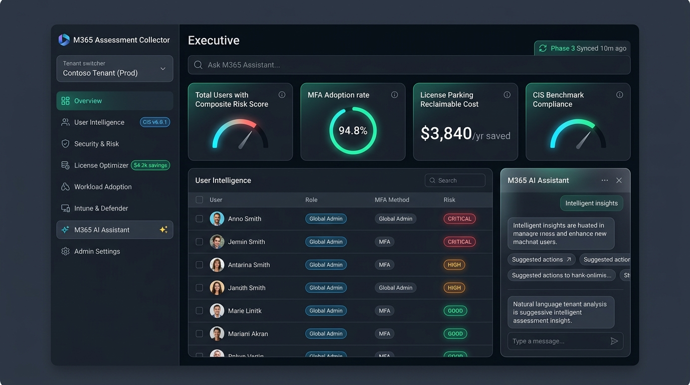

# M365 Assessment Collector

[](https://www.python.org/)
[](https://www.postgresql.org/)
[](https://docs.docker.com/compose/)
[](https://www.cisecurity.org/)
[]()
[]()

**M365 Assessment Collector** is an enterprise-ready, strictly read-only SaaS operations, security posture, and license optimization platform designed for **Managed Service Providers (MSPs)**, **Cloud Solution Providers (CSPs)**, and **IT Operations / SecOps teams** managing Microsoft 365 environments.

It automates data collection across Microsoft Entra ID, Intune, Defender, Exchange, OneDrive, SharePoint, and Teams, applies continuous CIS benchmark assessments, identifies license cost savings, and embeds an **AI-powered Operations & Security Assistant** with natural language capabilities and strict security guardrails.



---

## Table of Contents

- [Key Capabilities](#key-capabilities)
  - [1. Security Posture & CIS v6.0.1 Benchmark](#1-security-posture--cis-v601-benchmark)
  - [2. License Optimization & Cost Reclamation](#2-license-optimization--cost-reclamation)
  - [3. Workload Adoption & Operational Analytics](#3-workload-adoption--operational-analytics)
  - [4. AI Operations & Security Assistant](#4-ai-operations--security-assistant)
  - [5. Automated Scheduling & Executive Reporting](#5-automated-scheduling--executive-reporting)
  - [6. Modern Dashboards & RBAC](#6-modern-dashboards--rbac)
- [Architecture](#architecture)
- [Technology Stack](#technology-stack)
- [Required Microsoft Graph Permissions](#required-microsoft-graph-permissions)
- [Quick Start Guide](#quick-start-guide)
  - [Prerequisites](#prerequisites)
  - [Installation Steps](#installation-steps)
  - [Default Access Credentials](#default-access-credentials)
- [Configuration Reference](#configuration-reference)
  - [Environment Variables (.env)](#environment-variables-env)
  - [Secrets (secrets/)](#secrets-secrets)
- [API Overview](#api-overview)
- [Development & Operations](#development--operations)
  - [Running the Test Suite](#running-the-test-suite)
  - [Manual Collector Executions](#manual-collector-executions)
  - [Checking Scheduler & Service Logs](#checking-scheduler--service-logs)
- [Repository Structure](#repository-structure)
- [Security & Compliance Guarantees](#security--compliance-guarantees)

---

## Key Capabilities

### 1. Security Posture & CIS v6.0.1 Benchmark
- **Unified User Intelligence**: Continuous risk scoring (`CRITICAL`, `HIGH`, `MEDIUM`, `LOW`, `GOOD`) evaluating MFA registration, admin privileges, stale account state, and risky sign-ins.
- **MFA Coverage & Registration Audit**: Detailed tracking of user registration across FIDO2, Microsoft Authenticator, Phone/SMS, and identification of non-registered accounts.
- **Conditional Access Policy Audit**: Complete inventory of CA policies, state analysis (Enabled / Report-only / Disabled), and gap analysis against best practices.
- **Privileged Identity & Role Inventory**: Audit of Directory Roles (Global Admins, Privileged Role Admins) and Entra PIM assignments.
- **Sign-in Risk Analytics**: Detection of failed logins, legacy authentication protocol usage, suspicious sign-in events, and geo-location breakdown.
- **Device Security & Intune Compliance**: Device health assessment, non-compliant device tracking, and stale device detection.
- **Defender for Endpoint Integration**: Status visibility across monitored endpoints and security health states.
- **Guest Governance**: Detection of inactive or stale external guest accounts.

### 2. License Optimization & Cost Reclamation
- **Subscribed SKU Allocation**: Tracking of active licenses, total purchased units, consumed seats, and utilization rates calculated at the commercial Parent SKU level (preventing multi-counting of underlying service plans).
- **Trial & Free-Pool Isolation**: Filters out viral trial/free tier licenses (e.g., Power BI Free / standard quota pools) from commercial utilization calculations to ensure exact financial accuracy.
- **License Parking & Waste Detection**: Identifies assigned paid licenses on inactive accounts (30/60/90 days), blocked/disabled users, and orphaned mailboxes for direct cost reclamation.
- **Expiration Tracking**: Early warning on upcoming subscription renewals and license tier changes.

### 3. Workload Adoption & Operational Analytics
- **Exchange Online**: Mailbox activity metrics, storage quotas, and 30/60/90-day inactivity detection.
- **OneDrive for Business**: Storage utilization, quota trends, sharing behaviors, and high-value user audit.
- **SharePoint Online**: Site usage metrics, orphaned site detection, external sharing permissions, and storage consumption.
- **Microsoft Teams**: Active user metrics, channel/chat collaboration volume, and team engagement tracking.
- **Cross-Workload Correlation**: Unified user correlation tracking activity across all M365 workloads.

### 4. AI Operations & Security Assistant
- **ReAct Agent Architecture**: Conversational assistant powered by Anthropic Claude (via KryptonLab or direct API) or OpenAI models.
- **19 Operational Tools**: Dynamic inspection of live tenant state without granting the LLM direct database access.
- **Built-in Microsoft Learn Knowledge Base**: Responses enriched with authoritative Microsoft documentation and best-practice remediation steps.
- **Multi-layered Security Guardrails**:
  - Prompt injection and jailbreak blocking.
  - SQL injection syntax interception.
  - Data export and credential dump prevention.
- **Multilingual Support**: Fluent responses in English and Bahasa Indonesia.

### 5. Automated Scheduling & Executive Reporting
- **3-Phase Execution Pipeline**:
  - **Phase 1**: Identity, licensing, directory objects, and workload usage data.
  - **Phase 2**: Security evaluation, CIS M365 v6.0.1 scoring, and correlation calculation.
  - **Phase 3**: Intelligence aggregation, report dispatch, and maintenance tasks.
- **Automated 90-Day Retention**: Scheduled purge of historical sign-in and audit logs to prevent database bloat.
- **Executive Email Reports**: Automated HTML email delivery on daily or weekly schedules via SMTP.
- **Executive PDF Export (A4 Landscape)**: Instant one-click PDF export styled in A4 landscape format with dedicated print-ready executive header, tenant audit metadata, and prioritized risk summaries.

### 6. Modern Dashboards & RBAC
- **Unified Executive Overview Dashboard**: Front-page executive overview prioritizing actionable live findings, followed by two cohesive, divider-separated panels:
  - **Security Posture & Compliance**: Scored identities against CIS M365 v6.0.1, directory risk distribution, MFA registration & coverage radial gauge, and CIS benchmark compliance score.
  - **License FinOps & Cost Reclamation**: Standardized 3-metric financial optimization cards covering Total Assigned Seats across paid SKUs, Reclaimable Inactive Seats (>30d inactivity), and Projected Annual/Monthly Cost Savings ($/yr & $/mo).
- **Adaptive Mobile & Tablet Design**: Fully responsive layout across smartphones (320px–480px), tablets, and desktops with slide-out navigation drawer, tap-outside backdrop overlay, touch-friendly scrollable tables, and mobile-optimized AI assistant.
- **Smooth Live Telemetry Refresh**: Zero-layout-shift live telemetry hydration and smooth spinning indicator on manual refresh.
- **Modern UI v2**: Tabler-based responsive interface with paginated User Intelligence, CIS benchmark badges, and filterable tables.
- **Security Analyst Workbench**: Focused view for security teams to triage risky users, sign-in alerts, and CA policies.
- **Admin Management**: Tenant administration, user account management with TOTP MFA support, and audit log inspection.

---

## Architecture

```text
                                 +--------------------------------------------------+
                                 |                CLIENT / BROWSER                  |
                                 +--------------------------------------------------+
                                           |                        |
                           UI Assets & API |                        | Direct Auth / API
                                           v                        v
                        +------------------------------------------------------+
                        |               NGINX REVERSE PROXY                    |
                        |      Port 18080 -> Internal Routing & API Key        |
                        +------------------------------------------------------+
                                           |
                                           v
                        +------------------------------------------------------+
                        |            OPERATIONS REST API (:8080)               |
                        |  - Auth & TOTP Sessions      - Security Endpoints    |
                        |  - Operations Analytics      - License Optimizer     |
                        +------------------------------------------------------+
                                   |                                |
                       Query Tools |                                | Read-Only
                                   v                                v
+------------------------------------+             +------------------------------------+
|     M365 ASSISTANT (AI AGENT)      |             |         POSTGRESQL 16 DB           |
| - 19 Read-Only Inspection Tools    |             | - Schema: core, security, ops      |
| - Guardrails & KB Grounding        |             | - Multi-tenant Isolation           |
| - LLM: KryptonLab / Claude / OpenAI|             | - 90-day Event Retention           |
+------------------------------------+             +------------------------------------+
                                                                    ^
                                                                    | Persistence Dispatch
+------------------------------------+             +------------------------------------+
|        MICROSOFT GRAPH API         |             |        COLLECTOR & SCHEDULER       |
|  - Entra ID, Intune, Defender      | ----------->| - 3-Phase Execution Pipeline       |
|  - Exchange, SharePoint, OneDrive  |             | - APScheduler Interval & Cron      |
|  - App-Only Client Credentials     |             | - Executive Email Report Dispatch  |
+------------------------------------+             +------------------------------------+
```

### Security Isolation & Boundaries
- **Strictly Read-Only Graph API**: All granted permissions are read-only (`.Read.All`). The application cannot modify, delete, or alter any tenant configuration.
- **Safe Database Layer**: All queries use parameterized SQL bindings; no dynamic SQL injection vulnerabilities.
- **Least Privilege Execution**: Docker containers run as non-root users (`uid 70:70` and `uid 1000:1001`).
- **Secrets Management**: Graph API credentials and database passwords are provided exclusively via Docker secrets and environment variables.

---

## Technology Stack

| Layer | Technology |
|---|---|
| **Backend Runtime** | Python 3.13 |
| **Database** | PostgreSQL 16 Alpine |
| **Scheduler** | APScheduler (Interval & Cron triggers) |
| **Web Server / Proxy** | Nginx Alpine with sub_filter & proxy headers |
| **Frontend UI** | HTML5, Vanilla JavaScript (ES6+), CSS3, Tabler UI |
| **AI / LLM Orchestration** | ReAct Agent, KryptonLab API (`claude-sonnet-4-6`), OpenAI API |
| **Containerization** | Docker, Docker Compose (v2) |
| **Testing Framework** | Pytest (1,350+ unit and integration tests) |

---

## Required Microsoft Graph Permissions

Configure an **App Registration** in Microsoft Entra ID with **Application permissions** (requires admin consent):

| Permission | Type | Workload / Purpose |
|---|---|---|
| `User.Read.All` | Application | Read users, account status, and identity details |
| `Group.Read.All` | Application | Read security groups and Microsoft 365 groups |
| `Organization.Read.All` | Application | Read tenant details and verified domains |
| `LicenseAssignment.Read.All` | Application | Read license assignments and subscribed SKUs |
| `AuditLog.Read.All` | Application | Read Entra sign-in logs and directory audit events |
| `Policy.Read.All` | Application | Read Conditional Access policies and named locations |
| `RoleManagement.Read.Directory` | Application | Read directory roles and admin role assignments |
| `IdentityRiskyUser.Read.All` | Application | Read Entra ID Protection risky users |
| `IdentityRiskEvent.Read.All` | Application | Read Entra ID Protection risk detections |
| `Reports.Read.All` | Application | Read workload activity and usage analytics |
| `Device.Read.All` | Application | Read registered Entra devices |
| `AdministrativeUnit.Read.All` | Application | Read administrative units |
| `ServiceHealth.Read.All` | Application | Read M365 service health status and incidents |
| `ServiceMessage.Read.All` | Application | Read Message Center announcements |
| `DeviceManagementManagedDevices.Read.All` | Application | *(Optional)* Intune device compliance and enrollment |
| `SecurityEvents.Read.All` | Application | *(Optional)* Defender for Endpoint health alerts |

---

## Quick Start Guide

### Prerequisites
- [Docker](https://docs.docker.com/get-docker/) & [Docker Compose](https://docs.docker.com/compose/install/)
- Microsoft Entra ID Tenant with Application Administrator or Global Administrator access to register the App.

### Installation Steps

1. **Clone the repository:**
   ```bash
   git clone https://github.com/leekampgreen-hash/m365-assessment-collector.git
   cd m365-assessment-collector
   ```

2. **Configure Graph API Credentials:**
   Create the secret file `secrets/collector.env`:
   ```bash
   mkdir -p secrets
   cat <<EOF > secrets/collector.env
   GRAPH_TENANT_ID=your-azure-tenant-id
   GRAPH_CLIENT_ID=your-azure-client-id
   GRAPH_CLIENT_SECRET=your-azure-client-secret
   EOF
   chmod 600 secrets/collector.env
   ```

3. **Configure Database Passwords:**
   Generate secure random passwords for PostgreSQL:
   ```bash
   openssl rand -hex 24 > secrets/graph-agent-postgres-bootstrap-password
   openssl rand -hex 24 > secrets/graph-agent-migration-password
   openssl rand -hex 24 > secrets/graph-agent-runtime-password
   chmod 600 secrets/graph-agent-*
   ```

4. **Configure Environment Variables:**
   Copy `.env.example` to `.env` and fill in your keys:
   ```bash
   cp .env.example .env
   ```
   Set at least:
   - `API_KEY`: Strong random string used for API protection.
   - `KRYPTONLAB_API_KEY` or `OPENAI_API_KEY`: API key for AI assistant features.

5. **Start the Application:**
   ```bash
   docker compose up -d
   ```

6. **Verify Service Health:**
   ```bash
   docker compose ps
   ```
   Ensure `operations-api`, `operations-ui`, and `postgres` are marked healthy.

7. **Access the Dashboard:**
   Open your browser to:
   - **Operations UI**: [http://localhost:18080](http://localhost:18080)
   - **Modern UI v2**: [http://localhost:18080/v2/](http://localhost:18080/v2/)
   - **Security Analyst Workbench**: [http://localhost:18080/security-analyst.html](http://localhost:18080/security-analyst.html)
   - **Admin Console**: [http://localhost:18080/admin.html](http://localhost:18080/admin.html)

### Default Access Credentials
- **Email**: `admin@localhost`
- **Initial Password**: Configured during initial database bootstrap (see `docs/CLAUDE_CONTEXT.md` or initialize via `database/runtime/init/`).

---

## Configuration Reference

### Environment Variables (`.env`)

| Variable | Default | Description |
|---|---|---|
| `AGENT_MODE` | `live` | Agent execution mode (`live` or `mock`) |
| `MODEL` | `kl/claude-sonnet-4-6` | LLM model identifier |
| `KRYPTONLAB_API_KEY` | - | KryptonLab API key for Claude integration |
| `OPENAI_API_KEY` | - | *(Optional)* OpenAI API key |
| `API_KEY` | - | Internal and external API authentication key |
| `INTERNAL_API_PORT` | `8080` | Internal REST API port |
| `SMTP_HOST` | - | SMTP mail server for automated reports |
| `SMTP_PORT` | `587` | SMTP port |
| `SMTP_USER` | - | SMTP authentication username |
| `SMTP_PASSWORD` | - | SMTP authentication password |
| `REPORT_EMAIL_TO` | - | Recipient email addresses (comma-separated) |
| `REPORT_SCHEDULE` | `daily` | Frequency of executive email reports (`daily` or `weekly`) |
| `REPORT_ENABLED` | `false` | Enable automated email report delivery (`true`/`false`) |

### Secrets (`secrets/`)

| Secret File | Container Target | Description |
|---|---|---|
| `secrets/collector.env` | `/workspace/secrets/collector.env` | Graph API Tenant ID, Client ID, and Client Secret |
| `secrets/graph-agent-postgres-bootstrap-password` | `/run/secrets/...` | PostgreSQL bootstrap superuser password |
| `secrets/graph-agent-migration-password` | `/run/secrets/...` | PostgreSQL schema migration user password |
| `secrets/graph-agent-runtime-password` | `/run/secrets/...` | PostgreSQL operational runtime user password |

---

## API Overview

All API endpoints are exposed behind Nginx and authenticated via the `X-API-Key` header or an active `session_id` cookie:

### Operations & Analytics
- `GET /api/operations/kpi` — High-level operational metrics (users, mailboxes, licenses).
- `GET /api/operations/summary` — Tenant health summary and security status.
- `GET /api/operations/data-quality` — Data freshness and collection timestamps.
- `GET /api/operations/inactivity?days=30|60|90` — Inactive user breakdown.
- `GET /api/operations/adoption/exchange` — Exchange usage and mailbox statistics.
- `GET /api/operations/adoption/onedrive` — OneDrive storage and sync statistics.
- `GET /api/operations/adoption/sharepoint` — SharePoint site and storage statistics.
- `GET /api/operations/correlation/users` — Cross-workload user engagement.

### Security & CIS Benchmark
- `GET /api/intelligence/users` — Complete user intelligence with CIS v6.0.1 composite risk scoring (`CRITICAL`..`GOOD`).
- `GET /api/security/summary` — High-level security posture summary.
- `GET /api/security/findings` — Top security issues and remediation items.
- `GET /api/security/risk-score` — Combined risk score ranking across users.
- `GET /api/security/mfa-coverage` — Tenant-wide MFA enforcement rates.
- `GET /api/security/mfa-registration` — User-level authentication method status.
- `GET /api/security/ca-policies` — Conditional Access policy configuration audit.
- `GET /api/security/admin-roles` — Directory roles and privileged accounts.
- `GET /api/security/signin-summary` — Sign-in event statistics and failures.
- `GET /api/security/signin-risk` — Risky sign-in log events.
- `GET /api/security/signin-detail` — Detailed sign-in records and geo breakdown.

### Licensing & Cost Reclamation
- `GET /api/operations/license-utilization` — SKU utilization and assigned seat counts.
- `GET /api/license/parking-report` — License parking audit (inactive/disabled users with licenses).
- `GET /api/license/optimizer-report` — Potential financial savings from unassigned/wasted licenses.
- `GET /api/operations/license/expiry` — Subscription expiry timeline.

### Endpoint Management & Governance
- `GET /api/entra/guest-summary` — Guest user inventory and inactivity status.
- `GET /api/entra/stale-devices` — Inactive Entra-registered devices.
- `GET /api/entra/pim-summary` — Privileged Identity Management status.
- `GET /api/intune/compliance-summary` — Intune device compliance rates.
- `GET /api/intune/stale-devices` — Intune stale enrolled devices.

### AI Assistant & Management
- `POST /api/agent/analyze/security` — Trigger deep AI security posture evaluation.
- `POST /api/operations/chat` — Natural language Q&A conversation with the AI Agent.
- `GET /api/scheduler/status` — Current collector schedules and execution state.
- `GET /health` — Service healthcheck endpoint.

---

## Development & Operations

### Running the Test Suite
The codebase includes comprehensive unit and integration tests (1,350+ passing tests). Run them directly inside the collector container:

```bash
docker exec graph-agent-collector-dev pytest tests/ -x -q
```

### Manual Collector Executions
You can trigger specific collectors or endpoints manually on demand:

```bash
# Collect Entra ID Users (G01-001)
docker exec graph-agent-collector-dev python -m collectors.run_collector --endpoint G01-001

# Run Intune Compliance Collector
docker exec graph-agent-collector-dev python -m collectors.run_collector --intune-compliance

# Run Entra Guest Accounts Audit
docker exec graph-agent-collector-dev python -m collectors.run_collector --entra-guests

# Run Usage Reports (Exchange, OneDrive, SharePoint, Teams)
docker exec graph-agent-collector-dev python -m collectors.run_collector --all
```

### Checking Scheduler & Service Logs
```bash
# Tail scheduler logs
docker compose logs -f scheduler

# Tail operations API logs
docker compose logs -f operations-api

# Tail UI proxy logs
docker compose logs -f operations-ui
```

---

## Repository Structure

```text
.
├── agent/                  # AI Assistant core: ReAct orchestrator, tools, guardrails, KB
├── analytics/              # Processing, risk scoring, and correlation logic
├── api/                    # REST API handlers: operations, security, admin, auth
├── capabilities/           # Feature flags and tenant capability resolution
├── collectors/             # Microsoft Graph & Management Activity collectors & scheduler
│   ├── core/               # Bounded retry, pagination, token provider, transport
│   ├── workloads/          # Workload-specific collectors (Exchange, OD, SP, Teams)
│   └── usage_reports/      # Graph API usage and adoption report parsers
├── config/                 # Scheduler configuration and endpoint inventory specs
├── database/               # PostgreSQL schema migrations (001-020) and runtime init
├── docs/                   # Architectural blueprints, progress trackers, and audit logs
├── operations-ui/          # Nginx container config and frontend dashboard code
│   ├── public/             # Classic operations UI, security analyst & admin dashboards
│   └── public-v2/          # Modern Tabler-based responsive UI
├── scripts/                # Diagnostic utilities and runtime parity checks
├── secrets/                # Protected credential files (gitignored)
└── tests/                  # Pytest test suite (1,350+ test cases)
```

---

## Security & Compliance Guarantees

1. **Zero Tenant Modifications**: The system uses only Microsoft Graph Application Read permissions. It has zero capability to mutate users, update policies, or alter tenant settings.
2. **Credential Isolation**: Client secrets and database passwords are kept in isolated secret files and never written to logs or API payloads.
3. **Prompt Injection Protection**: The AI Assistant inspects all prompts for jailbreak patterns and SQL injection keywords prior to evaluation.
4. **Data Export Prevention**: Explicit safety guardrails prevent the AI Assistant from generating mass user or credential dumps.
5. **Data Minimization & Retention**: Sign-in logs older than 90 days are automatically purged during scheduled maintenance cycles.

---

## License

This project is licensed under the MIT License — see the [LICENSE](LICENSE) file for details.
