# Microsoft Graph Agentic Collector — Database Schema Design

> **G06-001 — Database Schema Design (DESIGN FIRST)**
> **Inputs:** `docs/data-catalog.md` (G03-001), `config/api_inventory.json` (G01), `docs/api-inventory.md`, `docs/permission-matrix.md` (G02), `docs/auth-app-registration-design.md` (G04), `docs/collector-framework.md` (G05)
> **Mode:** DESIGN ONLY — no DDL applied, no DB engine installed, no Graph calls, no secret handling, no framework changes
> **Status:** Authoritative logical + physical design proposal pending G06-002 implementation

---

## 1. Scope and Design Principles

This document is the **authoritative database design** for the Microsoft Graph
Agentic Collector platform. It is **design first**: every table, key, and
retention class is justified against the G03 data catalog and the G05
collector framework. No DDL is executed in G06-001.

### Design Principles

1. **Domain-oriented, not endpoint-oriented.** Tables are organised around
   reusable Microsoft 365 entities (User, Group, Conditional Access policy,
   Risk Detection, Role Assignment), not around individual Graph endpoint
   paths. A single physical table can host the persisted rows of multiple
   endpoints when they belong to the same domain (e.g. a single `audit_event`
   table serves both `directoryAudits` and `signIns`).
2. **Pattern-aware storage.** The four collection patterns defined in G03 —
   SNAPSHOT, EVENT_LOG, INCREMENTAL, REFERENCE — each map to a small set of
   storage idioms: upsert current-state, append-only fact, watermark-based
   upsert, and stable reference upsert.
3. **History is preserved by construction.** `HISTORICAL` and
   `HISTORICAL_WITH_SNAPSHOT` endpoints never overwrite prior rows; new
   observations create new rows. `CURRENT_ONLY` endpoints maintain exactly
   one row per Graph object id via deterministic upsert.
4. **Traceability without coupling.** Every operational row carries
   `collection_run_id` and `endpoint_run_id` lineage, plus the original
   Graph `source_object_id`. Analytics never need to depend on Graph
   response shape — only on the normalised columns.
5. **JSON payload preservation is pragmatic, not default.** `JSONB`
   extension columns exist only where Graph schemas are highly variable
   *and* the G03 catalog explicitly justifies retention. Default = no JSON
   payload. Raw response capture is isolated to a single optional raw
   trace store, never duplicated into the operational tables.
6. **Audit is a first-class schema.** Collection execution, endpoint
   execution, classification, retry behaviour, and timing are persisted in
   their own control schema; they never share tables with operational data.
7. **Privacy and security by design.** No Graph access tokens, no client
   secrets, no passwords, no Authorization headers are ever stored.
   HIGH_SENSITIVITY datasets carry the minimum field set already defined
   in `docs/data-catalog.md` Section 1.
8. **Tenant-aware without forcing multi-tenant complexity today.** A tenant
   registry exists; every operational and audit row carries `tenant_id`.
   The DEV implementation runs single-tenant; the schema does not require
   destructive redesign to add a second tenant later.
9. **No excessive enterprise warehouse.** Total proposed physical table
   count is bounded (see Section 20). We deliberately avoid speculative
   fact/dimension star schemas; serving analytics is achieved through
   small views, not a warehouse project.

---

## 2. Database Technology Decision

### Existing authoritative decision

No database engine has been formally selected in any prior G-task. The
only references are conceptual: `docs/collector-framework.md` explicitly
notes that *“G06 — database schema and persistence for collected rows”*
belongs to G06, and `docs/auth-app-registration-design.md` enumerates the
*“Database / storage layer”* as a separate trust boundary in the future
production architecture. Both are future-state markers, not selections.

### G06-001 decision

**PostgreSQL is proposed as the G06 implementation target.**

- **Rationale.** The platform needs relational integrity (control/audit
  joins on `collection_run` → `endpoint_run` → operational rows), JSONB
  for pragmatic Graph-payload extension where justified, partial unique
  indexes for `HISTORICAL_WITH_SNAPSHOT` deduplication, partial indexes for
  filtered retention queries, and window-function analytics for KPI views.
  PostgreSQL is the mainstream open-source engine that satisfies all four
  requirements without adding operational overhead to the single-tenant
  DEV deployment.
- **Consequence.** G06-002 (and later) can install, configure, and persist
  using PostgreSQL. If a future G-task mandates a different engine (e.g.
  SQLite for purely offline DEV, or a cloud warehouse), the logical
  design in this document is portable; only DDL and adapter code change.

### Out of scope for G06-001

PostgreSQL is **not** installed, configured, or started in G06-001. The
design is engine-agnostic in its logical form and engine-specific only at
the physical DDL level (proposed but not executed).

---

## 3. Required Logical Schemas / Areas

Four logical schemas separate concerns. Each has a single, narrow purpose.

| Schema | Purpose | Audience | Read pattern |
|---|---|---|---|
| `control` | Collection execution, endpoint execution, classification, timing, lineage | Operators, on-call | Operational dashboards, incident triage |
| `raw` | Optional raw Graph response preservation for evidence/traceability | Auditors, investigators | Forensic reconstruction only |
| `core` | Reusable Microsoft 365 operational entities (users, groups, policies, events, role assignments, licences, etc.) | KPI consumers, dashboards | Operational analytics, join-driven queries |
| `analytics` | Materialised views / serving layer over `core` for KPI/operational analytics | Reporting | Dashboard queries, KPI extracts |

Rationale:

- **`control` is separate from `core`** because collection metadata has
  different retention (short, structured, internal-only), different access
  controls, and different index patterns than operational data.
- **`raw` is separate from `core`** because raw Graph payloads can carry
  PII, IP, geo, and user-agent material that the G03 catalog explicitly
  excludes from production collection. Isolating raw to a dedicated schema
  lets us apply stricter access controls and a tighter retention policy
  without forcing the same constraints on normalised data.
- **`analytics` is a thin serving layer**, not a warehouse. Materialised
  views / named views over `core` are the only construct used. No new
  dimensional model, no ETL pipeline.
- **`audit_log` does not exist as a fifth schema.** Audit-of-collection is
  captured inside `control` (it is metadata about the collector itself).
  The `raw` schema is for Graph evidence, not collector audit.

---

## 4. Collection-Pattern Mapping (Validated)

Pattern reconciliation against `docs/data-catalog.md` Section 3 (verified
deterministically — see Section 22):

| Collection Pattern | Endpoints | Count |
|---|---|---|
| SNAPSHOT | G01-001, G01-002, G01-003, G01-004, G01-007, G01-008, G01-009, G01-010, G01-011, G01-012, G01-013, G01-015, G01-019 | 13 |
| EVENT_LOG | G01-005, G01-006, G01-014 | 3 |
| INCREMENTAL | G01-016, G01-017 | 2 |
| REFERENCE | G01-018 | 1 |
| **Total** | | **19** |

History reconciliation against `docs/data-catalog.md` Section 4:

| History Requirement | Endpoints | Count |
|---|---|---|
| CURRENT_ONLY | G01-001, G01-002, G01-003, G01-007, G01-008, G01-009, G01-010, G01-012, G01-018 | 9 |
| HISTORICAL | G01-005, G01-006, G01-014, G01-016, G01-017 | 5 |
| HISTORICAL_WITH_SNAPSHOT | G01-004, G01-011, G01-013, G01-015, G01-019 | 5 |
| **Total** | | **19** |

Database semantics:

- **EVENT_LOG (3): G01-005, G01-006, G01-014** — append-only, deduped by
  source event `id`.
- **HISTORICAL_WITH_SNAPSHOT (5): G01-004, G01-011, G01-013, G01-015,
  G01-019** — current-state upsert **plus** a versioned snapshot row per
  run; history preserved.
- **INCREMENTAL (2): G01-016, G01-017** — current-state upsert by
  source id **plus** a versioned history row per meaningful observation;
  `HISTORICAL` semantics preserved via `*_history` tables (see Sections
  7.7.a and 7.7.b). INCREMENTAL additionally uses watermark-based
  filtering before upsert.
- **Upsert-by-id candidates (16):** all 13 SNAPSHOT, the 1 REFERENCE
  (G01-018), and the 2 INCREMENTAL (G01-016, G01-017). The 5
  HISTORICAL_WITH_SNAPSHOT and the 2 INCREMENTAL each also have a
  companion history/snapshot table for version preservation.

No G03 classifications are silently changed. G03 values are taken verbatim.

---

## 5. Control / Audit Model

The control schema records what the collector did and what happened. It is
the system of record for collection lineage.

### `control.collection_run`

One row per `CollectorRuntime.run(...)` call. Identifies a single execution
attempt of the runtime, regardless of how many endpoints were selected.

| Column | Type | Notes |
|---|---|---|
| `collection_run_id` | `BIGSERIAL` PRIMARY KEY | Internal surrogate |
| `run_uuid` | `UUID` UNIQUE NOT NULL | Stable external identifier for evidence correlation |
| `tenant_id` | `BIGINT` NOT NULL REFERENCES `core.tenant(tenant_id)` | Tenant scope |
| `started_at` | `TIMESTAMPTZ` NOT NULL | Timezone-aware; set when the runtime begins |
| `completed_at` | `TIMESTAMPTZ` NULL | Set on run termination |
| `status` | `TEXT` NOT NULL CHECK (status IN ('RUNNING','SUCCESS','PARTIAL_SUCCESS','FAILED')) | Final status; PARTIAL_SUCCESS when some endpoints succeed and others fail |
| `trigger_source` | `TEXT` NOT NULL | e.g. `cli`, `scheduler`, `api`, `manual` |
| `collector_version` | `TEXT` NOT NULL | Collector framework version (G05) |
| `config_version` | `TEXT` NULL | Inventory/config bundle version when available |
| `selected_endpoint_ids` | `TEXT[]` NOT NULL | Endpoint ids selected for this run, in order |
| `endpoints_total` | `INTEGER` NOT NULL | Count of endpoints attempted |
| `endpoints_passed` | `INTEGER` NOT NULL DEFAULT 0 | Aggregate counters |
| `endpoints_failed` | `INTEGER` NOT NULL DEFAULT 0 | |
| `rows_total` | `BIGINT` NOT NULL DEFAULT 0 | Sum of `endpoint_run.rows` |
| `auth_error_classification` | `TEXT` NULL | Pre-execution auth error classification if the run never reached the endpoint loop |
| `error_summary` | `JSONB` NULL | Sanitised aggregate failure summary; never carries tokens or secrets |

Indexes:

- `(status, started_at DESC)` — operator dashboards and recent-run queries.
- `(tenant_id, started_at DESC)` — tenant-scoped audit pulls.
- `(run_uuid)` UNIQUE — evidence correlation.

### `control.endpoint_run`

One row per endpoint attempted inside a `collection_run`.

| Column | Type | Notes |
|---|---|---|
| `endpoint_run_id` | `BIGSERIAL` PRIMARY KEY | Internal surrogate |
| `collection_run_id` | `BIGINT` NOT NULL REFERENCES `control.collection_run(collection_run_id) ON DELETE CASCADE` | Parent run |
| `endpoint_id` | `TEXT` NOT NULL | G01 endpoint id (`G01-001` … `G01-019`) |
| `endpoint_name` | `TEXT` NOT NULL | Human-readable endpoint name from inventory |
| `tenant_id` | `BIGINT` NOT NULL REFERENCES `core.tenant(tenant_id)` | Denormalised for index-only tenant scoping |
| `started_at` | `TIMESTAMPTZ` NOT NULL | |
| `completed_at` | `TIMESTAMPTZ` NULL | |
| `status` | `TEXT` NOT NULL CHECK (status IN ('PASS','ERROR')) | Mirrors `CollectionResult.status` |
| `pages` | `INTEGER` NOT NULL DEFAULT 0 | |
| `rows` | `BIGINT` NOT NULL DEFAULT 0 | |
| `http_status` | `INTEGER` NULL | Last observed HTTP status; null if no Graph call attempted |
| `error_classification` | `TEXT` NULL CHECK (error_classification IN ('PASS','AUTH_FAILURE','PERMISSION_REQUIRED','THROTTLED','API_ERROR','NETWORK_ERROR','UNKNOWN','ENTITY_IDENTITY_UNAVAILABLE','PERSISTENCE_ERROR') OR error_classification IS NULL) | Framework classification; controlled identity limitation and persistence failure are distinct terminal domains |
| `error_message_safe` | `TEXT` NULL | Sanitised: classification label only, no token / secret / Authorization |
| `retry_count` | `INTEGER` NOT NULL DEFAULT 0 | Final retry count from `CollectionResult.retry_count` |
| `graph_error_code` | `TEXT` NULL | Graph-side error code when available |

Indexes:

- `(collection_run_id, endpoint_id)` UNIQUE — one row per endpoint per run.
- `(tenant_id, endpoint_id, started_at DESC)` — per-endpoint history.
- `(status, started_at DESC)` — operational triage.

### Partial-success guarantee

`endpoint_run` rows are committed **independently per endpoint**. A single
endpoint failure does not roll back successful endpoint persistence
(see Section 17 for transaction semantics). The parent
`collection_run.status` is reconciled from its children on completion:
- all children PASS → `SUCCESS`,
- mixed → `PARTIAL_SUCCESS`,
- all children ERROR and no successful row → `FAILED`.

### Key/index summary

| Index | Purpose |
|---|---|
| `endpoint_run_pkey` | Surrogate identity |
| `endpoint_run_run_endpoint_uniq` | Idempotency of one endpoint per run |
| `endpoint_run_tenant_endpoint_time` | Per-tenant endpoint history |
| `endpoint_run_status_time` | Operational triage |
| `collection_run_status_time` | Recent-run dashboards |
| `collection_run_tenant_time` | Tenant audit pulls |

---

## 6. Raw Ingestion / Traceability

### Decision

A single generic `raw.raw_graph_record` table is justified **only as an
optional forensics / evidence trace**, not as a production storage layer.
It is **not** populated for every collection by default.

### Why raw payload retention exists at all

- Operator-facing evidence: a failed endpoint may need reconstruction to
  diagnose why G05 reported an error.
- Audit-of-evidence: `control.endpoint_run` records *what* was attempted;
  `raw` records *what was actually returned*, if anything.

### Why it is not populated by default

- Cost and volume: Graph responses for events (`signIns`, `directoryAudits`)
  can be large; storing them indefinitely is wasteful.
- Privacy: raw payloads routinely contain IP, geo, user-agent,
  correlation IDs — material the G03 catalog explicitly excludes from
  production storage.
- Determinism: the operational tables are derived from a sanitised,
  curated subset; copying raw payloads duplicates authoritative content.

### `raw.raw_graph_record`

| Column | Type | Notes |
|---|---|---|
| `raw_record_id` | `BIGSERIAL` PRIMARY KEY | |
| `collection_run_id` | `BIGINT` NOT NULL REFERENCES `control.collection_run(collection_run_id) ON DELETE CASCADE` | |
| `endpoint_run_id` | `BIGINT` NOT NULL REFERENCES `control.endpoint_run(endpoint_run_id) ON DELETE CASCADE` | |
| `endpoint_id` | `TEXT` NOT NULL | |
| `tenant_id` | `BIGINT` NOT NULL REFERENCES `core.tenant(tenant_id)` | |
| `source_object_id` | `TEXT` NULL | Graph object/event id when present |
| `collected_at` | `TIMESTAMPTZ` NOT NULL | |
| `payload` | `JSONB` NOT NULL | Sanitised payload — secret scrubber applied before insert |
| `payload_sha256` | `BYTEA` NOT NULL | Hash for dedup and tamper-evidence |
| `payload_byte_size` | `INTEGER` NOT NULL | Size for capacity planning |

Indexes:

- `(endpoint_run_id)` — most raw queries are scoped to a single endpoint
  execution.
- `(tenant_id, endpoint_id, collected_at DESC)` — tenant-scoped evidence
  pulls.
- `(payload_sha256)` — dedup detection across re-runs.

### What must NOT be retained in `payload`

The same scrubbing rules as G05 `safe_dumps` apply at insert time:

- No `Authorization` header values.
- No `access_token` / `refresh_token` values.
- No `client_secret` values.
- No password fields.
- No client-supplied Authorization context.

The insert path is responsible for scrubbing; `raw.payload` is a
`JSONB` column without secrets, and the database grants restrict read
access to operators only.

### Which endpoints are eligible

- Default: raw retention is **off**. Operators enable it per-endpoint
  through a runtime flag (future G-task; not implemented in G06-001).
- Allowed targets: any endpoint where the G03 catalog explicitly permits
  raw retention of the curated fields. By default, raw retention of free
  text, body content, IP ranges, role permission bodies, or any field the
  G03 catalog excludes is **prohibited** even with the flag.

### Retention

`raw` retention is governed by a separate (shorter) policy than `core`;
raw evidence is not intended for long-term operational use.

---

## 7. Core Entity Model

Tables in `core` host the normalised operational entities derived from
the 19 G01 endpoints. The mapping is **domain-oriented**, not one-to-one
per endpoint.

### Identity / Directory

#### `core.tenant`

| Column | Type | Notes |
|---|---|---|
| `tenant_id` | `BIGSERIAL` PRIMARY KEY | Internal surrogate |
| `entra_tenant_id` | `TEXT` UNIQUE NOT NULL | Microsoft Entra directory id |
| `display_label` | `TEXT` NOT NULL | Operator-friendly label |
| `enabled` | `BOOLEAN` NOT NULL DEFAULT TRUE | |
| `created_at` | `TIMESTAMPTZ` NOT NULL DEFAULT now() | |
| `updated_at` | `TIMESTAMPTZ` NOT NULL DEFAULT now() | |

**Never stores:** tenant credentials, client secrets, access tokens, or
certificate material. The tenant table is a registry, not a vault.

#### `core.user`

Source: G01-001 (`/v1.0/users`). CURRENT_ONLY upsert by Graph `id`.

| Column | Type | Notes |
|---|---|---|
| `user_id` | `BIGSERIAL` PRIMARY KEY | Internal surrogate |
| `tenant_id` | `BIGINT` NOT NULL REFERENCES `core.tenant(tenant_id)` | |
| `source_object_id` | `TEXT` NOT NULL | Graph `id` |
| `user_principal_name` | `TEXT` NULL | `userPrincipalName` |
| `display_name` | `TEXT` NULL | `displayName` |
| `user_type` | `TEXT` NULL | `userType` |
| `account_enabled` | `BOOLEAN` NULL | |
| `created_date_time` | `TIMESTAMPTZ` NULL | `createdDateTime` |
| `last_observed_at` | `TIMESTAMPTZ` NOT NULL | `collected_at` of the most recent observation |
| `extension` | `JSONB` NULL | Reserved; populated only when future catalog rows justify it |

Keys / uniqueness: UNIQUE (`tenant_id`, `source_object_id`).

#### `core.group`

Source: G01-002. CURRENT_ONLY upsert.

| Column | Type | Notes |
|---|---|---|
| `group_id` | `BIGSERIAL` PRIMARY KEY | |
| `tenant_id` | `BIGINT` NOT NULL | |
| `source_object_id` | `TEXT` NOT NULL | Graph `id` |
| `display_name` | `TEXT` NULL | |
| `mail` | `TEXT` NULL | |
| `mail_enabled` | `BOOLEAN` NULL | |
| `security_enabled` | `BOOLEAN` NULL | |
| `group_types` | `TEXT[]` NULL | |
| `last_observed_at` | `TIMESTAMPTZ` NOT NULL | |

UNIQUE (`tenant_id`, `source_object_id`).

#### `core.organization`

Source: G01-003. CURRENT_ONLY; expected single row per tenant.

| Column | Type | Notes |
|---|---|---|
| `organization_id` | `BIGSERIAL` PRIMARY KEY | |
| `tenant_id` | `BIGINT` NOT NULL UNIQUE | |
| `source_object_id` | `TEXT` NOT NULL | Graph `id` |
| `display_name` | `TEXT` NULL | |
| `country_letter_code` | `TEXT` NULL | |
| `tenant_type` | `TEXT` NULL | |
| `verified_domains` | `JSONB` NULL | Verified-domain list, sanitised |
| `last_observed_at` | `TIMESTAMPTZ` NOT NULL | |

#### `core.application`

Source: G01-007. CURRENT_ONLY.

| Column | Type | Notes |
|---|---|---|
| `application_id` | `BIGSERIAL` PRIMARY KEY | |
| `tenant_id` | `BIGINT` NOT NULL | |
| `source_object_id` | `TEXT` NOT NULL | Graph `id` |
| `app_id` | `TEXT` NULL | Public-ish identifier; not a credential |
| `display_name` | `TEXT` NULL | |
| `sign_in_audience` | `TEXT` NULL | |
| `created_date_time` | `TIMESTAMPTZ` NULL | |
| `last_observed_at` | `TIMESTAMPTZ` NOT NULL | |

UNIQUE (`tenant_id`, `source_object_id`).

#### `core.service_principal`

Source: G01-008. CURRENT_ONLY.

| Column | Type | Notes |
|---|---|---|
| `service_principal_id` | `BIGSERIAL` PRIMARY KEY | |
| `tenant_id` | `BIGINT` NOT NULL | |
| `source_object_id` | `TEXT` NOT NULL | Graph `id` |
| `app_id` | `TEXT` NULL | Joins to `application.app_id` for app↔spn correlation |
| `display_name` | `TEXT` NULL | |
| `account_enabled` | `BOOLEAN` NULL | |
| `service_principal_type` | `TEXT` NULL | |
| `last_observed_at` | `TIMESTAMPTZ` NOT NULL | |

UNIQUE (`tenant_id`, `source_object_id`).

#### `core.device`

Source: G01-009. CURRENT_ONLY.

| Column | Type | Notes |
|---|---|---|
| `device_id` | `BIGSERIAL` PRIMARY KEY | |
| `tenant_id` | `BIGINT` NOT NULL | |
| `source_object_id` | `TEXT` NOT NULL | Graph `id` |
| `device_graph_id` | `TEXT` NULL | `deviceId` |
| `account_enabled` | `BOOLEAN` NULL | |
| `operating_system` | `TEXT` NULL | |
| `operating_system_version` | `TEXT` NULL | |
| `trust_type` | `TEXT` NULL | |
| `approximate_last_sign_in_date_time` | `TIMESTAMPTZ` NULL | Operational only, not a watermark |
| `last_observed_at` | `TIMESTAMPTZ` NOT NULL | |

UNIQUE (`tenant_id`, `source_object_id`).

#### `core.administrative_unit`

Source: G01-010. CURRENT_ONLY; 0 rows at discovery is expected.

| Column | Type | Notes |
|---|---|---|
| `administrative_unit_id` | `BIGSERIAL` PRIMARY KEY | |
| `tenant_id` | `BIGINT` NOT NULL | |
| `source_object_id` | `TEXT` NOT NULL | |
| `display_name` | `TEXT` NULL | |
| `description` | `TEXT` NULL | |
| `visibility` | `TEXT` NULL | |
| `last_observed_at` | `TIMESTAMPTZ` NOT NULL | |

UNIQUE (`tenant_id`, `source_object_id`).

### Licensing

#### `core.subscribed_sku` and `core.subscribed_sku_snapshot`

G01-004 is HISTORICAL_WITH_SNAPSHOT, so we keep **two** physical
representations:

- `core.subscribed_sku` — current state, one row per Graph `id`,
  upserted by id. CURRENT_ONLY view of consumption.
- `core.subscribed_sku_snapshot` — append-only snapshot per collection
  run; one row per Graph `id` per snapshot; effective timestamp =
  `collection_run_id`-derived.

`core.subscribed_sku`

| Column | Type | Notes |
|---|---|---|
| `subscribed_sku_id` | `BIGSERIAL` PRIMARY KEY | |
| `tenant_id` | `BIGINT` NOT NULL | |
| `source_object_id` | `TEXT` NOT NULL | Graph `id` |
| `sku_id` | `TEXT` NULL | |
| `sku_part_number` | `TEXT` NULL | |
| `capability_status` | `TEXT` NULL | |
| `consumed_units` | `INTEGER` NULL | |
| `prepaid_units` | `INTEGER` NULL | |
| `service_plans` | `JSONB` NULL | Flattened selected fields |
| `last_observed_at` | `TIMESTAMPTZ` NOT NULL | |

UNIQUE (`tenant_id`, `source_object_id`).

`core.subscribed_sku_snapshot`

| Column | Type | Notes |
|---|---|---|
| `snapshot_id` | `BIGSERIAL` PRIMARY KEY | |
| `tenant_id` | `BIGINT` NOT NULL | |
| `source_object_id` | `TEXT` NOT NULL | Graph `id` |
| `collection_run_id` | `BIGINT` NOT NULL REFERENCES `control.collection_run(collection_run_id)` | |
| `endpoint_run_id` | `BIGINT` NOT NULL REFERENCES `control.endpoint_run(endpoint_run_id)` | |
| `snapshot_at` | `TIMESTAMPTZ` NOT NULL | Effective timestamp |
| `consumed_units` | `INTEGER` NULL | |
| `prepaid_units` | `INTEGER` NULL | |
| `capability_status` | `TEXT` NULL | |
| `service_plans` | `JSONB` NULL | |

UNIQUE (`tenant_id`, `source_object_id`, `collection_run_id`).

#### `core.user_license_assignment` (User ↔ SKU mapping)

G01-001 / STD-10 canonical app-only User ↔ License mapping (migration
`009_user_license_assignment.sql`). One row per `(tenant, user, sku)`
entitlement. Derived from `user.assignedLicenses[].skuId` (G01-001,
`LicenseAssignment.Read.All`) and reference-joined to the subscribed-SKU
inventory on `(tenant_id, sku_id)` so only SKUs present in
`core.subscribed_sku` are persisted. No `/licenseDetails` and no
delegated-user dependency.

| Column | Type | Notes |
|---|---|---|
| `user_license_assignment_id` | `BIGSERIAL` PRIMARY KEY | |
| `tenant_id` | `BIGINT` NOT NULL | FK `core.tenant(tenant_id)` ON DELETE RESTRICT |
| `user_id` | `BIGINT` NOT NULL | FK `core."user"(user_id)` ON DELETE RESTRICT |
| `sku_id` | `TEXT` NOT NULL | Immutable Graph SKU identifier; matches `subscribed_sku.sku_id` |
| `first_observed_at` | `TIMESTAMPTZ` NOT NULL | |
| `last_observed_at` | `TIMESTAMPTZ` NOT NULL | |

UNIQUE (`tenant_id`, `user_id`, `sku_id`); index
`user_license_assignment_tenant_sku_idx (tenant_id, sku_id)`.

- **Replace semantics:** on a complete G01-001 user refresh where
  `assignedLicenses` is fully available, the tenant's assignment set is
  deleted and rebuilt, so stale/removed SKUs disappear.
- **Partial evidence:** if any user record lacks `assignedLicenses`, the
  refresh is aborted and the existing assignment set is preserved (never
  wrongly cleared).
- **Unknown SKU:** a `sku_id` absent from `core.subscribed_sku` is silently
  omitted at write time (application reference behavior; not an FK).

### Security / Audit (Append-only event streams)

#### `core.onedrive_high_value_audit_event`

OD-P04 OneDrive high-value audit events are append-only, tenant-scoped, and deduplicated by `(tenant_id, audit_record_id)`. Only normalized OneDrive `AnonymousLinkCreated`, Guest-targeted `SharingInvitationCreated`/`SharingSet`, and `FileMalwareDetected` records are persisted. Optional source fields remain nullable; no raw audit payload is retained.

| Column | Type | Notes |
|---|---|---|
| `onedrive_high_value_audit_event_id` | `BIGSERIAL` PRIMARY KEY | |
| `tenant_id` | `BIGINT` | Tenant scope, `ON DELETE RESTRICT` |
| `audit_record_id` | `TEXT` | Authoritative Management Activity `Id` |
| `event_time` | `TIMESTAMPTZ` | `CreationTime` |
| `operation` / `workload` / `record_type` | `TEXT` | Workload is constrained to `OneDrive` |
| `actor_upn` / `event_category` | `TEXT` | Optional actor and `EXTERNAL_SHARING`/`MALWARE_DETECTED` |
| `external_flag` / `anonymous_flag` | `BOOLEAN` | Derived classification |
| `collected_at` | `TIMESTAMPTZ` | Ingestion time |
| optional source fields | nullable | Client IP, object/site/file/link/target metadata |
| lineage and retention | nullable / `TEXT` | Collection lineage and `LONG` default |

UNIQUE (`tenant_id`, `audit_record_id`). Inserts use `ON CONFLICT DO NOTHING`; overlapping windows and late arrivals are safe, and no tenant-wide replacement is performed.

#### `core.audit_event`

Serves G01-005 (Directory Audit Logs) and G01-006 (Sign-in Logs) via a
single shared append-only fact table. The discriminator column
`event_source` distinguishes the two streams; the unified shape keeps the
event-store pattern uniform and allows shared indexing strategy.

| Column | Type | Notes |
|---|---|---|
| `audit_event_id` | `BIGSERIAL` PRIMARY KEY | |
| `tenant_id` | `BIGINT` NOT NULL | |
| `event_source` | `TEXT` NOT NULL CHECK (event_source IN ('DIRECTORY_AUDIT','SIGN_IN')) | |
| `source_object_id` | `TEXT` NOT NULL | Graph event `id` |
| `event_at` | `TIMESTAMPTZ` NOT NULL | `activityDateTime` for audits, `createdDateTime` for sign-ins |
| `collected_at` | `TIMESTAMPTZ` NOT NULL | |
| `collection_run_id` | `BIGINT` NOT NULL | |
| `endpoint_run_id` | `BIGINT` NOT NULL | |
| `actor_user_id` | `TEXT` NULL | `userId` for sign-ins; `actor` references for audits |
| `actor_app_id` | `TEXT` NULL | `appId` (sign-ins) |
| `activity` | `TEXT` NULL | `activityDisplayName` (audits) / `clientAppUsed` (sign-ins) |
| `category` | `TEXT` NULL | `category` (audits) / `status` family (sign-ins) |
| `result` | `TEXT` NULL | `result` (audits) / `status.errorCode` family (sign-ins) |
| `is_interactive` | `BOOLEAN` NULL | Sign-ins only |
| `risk_level` | `TEXT` NULL | Reserved for future cross-stream correlation; null for these endpoints |
| `extension` | `JSONB` NULL | Reserved; not populated in G06 |

UNIQUE (`tenant_id`, `event_source`, `source_object_id`) — guarantees
deduplication of re-ingested events.

Explicitly excluded columns (per `docs/data-catalog.md` data-minimization):
IP address, location details, user agent, correlation IDs, device/browser
detail fields.

#### `core.risk_detection`

G01-014. Append-only fact.

| Column | Type | Notes |
|---|---|---|
| `risk_detection_id` | `BIGSERIAL` PRIMARY KEY | |
| `tenant_id` | `BIGINT` NOT NULL | |
| `source_object_id` | `TEXT` NOT NULL | Graph event `id` |
| `detected_at` | `TIMESTAMPTZ` NOT NULL | `detectedDateTime` |
| `activity_at` | `TIMESTAMPTZ` NULL | `activityDateTime` |
| `collected_at` | `TIMESTAMPTZ` NOT NULL | |
| `collection_run_id` | `BIGINT` NOT NULL | |
| `endpoint_run_id` | `BIGINT` NOT NULL | |
| `risk_event_type` | `TEXT` NULL | |
| `risk_level` | `TEXT` NULL | |
| `risk_state` | `TEXT` NULL | |
| `risk_detail` | `TEXT` NULL | |
| `detection_timing_type` | `TEXT` NULL | |
| `activity` | `TEXT` NULL | |
| `affected_user_id` | `TEXT` NULL | Graph user id; not a PII expansion |

UNIQUE (`tenant_id`, `source_object_id`).

Excluded: user location, IP, user agent, correlation IDs.

### Identity Protection (Current-state + Snapshot)

#### `core.risky_user` and `core.risky_user_snapshot`

G01-013 is HISTORICAL_WITH_SNAPSHOT. Same two-table idiom as SKUs.

`core.risky_user` (current state)

| Column | Type | Notes |
|---|---|---|
| `risky_user_id` | `BIGSERIAL` PRIMARY KEY | |
| `tenant_id` | `BIGINT` NOT NULL | |
| `source_object_id` | `TEXT` NOT NULL | Graph `id` |
| `risk_level` | `TEXT` NULL | |
| `risk_state` | `TEXT` NULL | |
| `risk_detail` | `TEXT` NULL | |
| `is_deleted` | `BOOLEAN` NULL | |
| `is_processing` | `BOOLEAN` NULL | |
| `risk_last_updated_at` | `TIMESTAMPTZ` NULL | `riskLastUpdatedDateTime` |
| `last_observed_at` | `TIMESTAMPTZ` NOT NULL | |

UNIQUE (`tenant_id`, `source_object_id`).

`core.risky_user_snapshot` — same pattern as `subscribed_sku_snapshot`,
keys (`tenant_id`, `source_object_id`, `collection_run_id`).

### Conditional Access

#### `core.conditional_access_policy` and `core.conditional_access_policy_snapshot`

G01-011 HISTORICAL_WITH_SNAPSHOT.

Current-state table mirrors the curated fields; snapshot table adds
`collection_run_id`, `endpoint_run_id`, `snapshot_at`. Snapshot keys:
(`tenant_id`, `source_object_id`, `collection_run_id`).

Per `docs/data-catalog.md` notes: store metadata + state only; **no**
conditions/grants policy bodies.

#### `core.named_location`

G01-012 CURRENT_ONLY.

| Column | Type | Notes |
|---|---|---|
| `named_location_id` | `BIGSERIAL` PRIMARY KEY | |
| `tenant_id` | `BIGINT` NOT NULL | |
| `source_object_id` | `TEXT` NOT NULL | |
| `display_name` | `TEXT` NULL | |
| `created_date_time` | `TIMESTAMPTZ` NULL | |
| `modified_date_time` | `TIMESTAMPTZ` NULL | |
| `last_observed_at` | `TIMESTAMPTZ` NOT NULL | |

UNIQUE (`tenant_id`, `source_object_id`).

Per G03: raw `ipRanges` / country lists are excluded by default.

### RBAC

#### `core.directory_role_definition` (REFERENCE)

G01-018. Stable reference.

| Column | Type | Notes |
|---|---|---|
| `directory_role_definition_id` | `BIGSERIAL` PRIMARY KEY | |
| `tenant_id` | `BIGINT` NOT NULL | |
| `source_object_id` | `TEXT` NOT NULL | Graph role definition `id` |
| `display_name` | `TEXT` NULL | |
| `description` | `TEXT` NULL | |
| `is_built_in` | `BOOLEAN` NULL | |
| `last_observed_at` | `TIMESTAMPTZ` NOT NULL | |

UNIQUE (`tenant_id`, `source_object_id`).

Per G03: `rolePermissions` payloads are excluded.

#### `core.directory_role_assignment` and `core.directory_role_assignment_snapshot`

G01-019 HISTORICAL_WITH_SNAPSHOT.

Current-state carries `role_definition_id` + `principal_id` +
`directory_scope_id`; snapshot rows record the assignment as observed
in each run. UNIQUE on (`tenant_id`, `source_object_id`,
`collection_run_id`) for snapshots.

### Service Health / Change Communications

#### `core.service_health_overview` and `core.service_health_overview_snapshot`

G01-015 HISTORICAL_WITH_SNAPSHOT.

Current-state rows: `service`, `status`. Snapshot rows append per run.

#### `core.service_health_issue` (INCREMENTAL — current state)

G01-016. INCREMENTAL — watermark-based upsert by Graph `id`. Carries the
**latest observed state** of each service health issue. Lifecycle changes
are preserved in the companion history table below (Section 7.7.a), not
by overwriting this row.

| Column | Type | Notes |
|---|---|---|
| `service_health_issue_id` | `BIGSERIAL` PRIMARY KEY | |
| `tenant_id` | `BIGINT` NOT NULL | |
| `source_object_id` | `TEXT` NOT NULL | Graph `id` |
| `service` | `TEXT` NULL | |
| `status` | `TEXT` NULL | |
| `classification` | `TEXT` NULL | |
| `start_date_time` | `TIMESTAMPTZ` NULL | Origin timestamp |
| `end_date_time` | `TIMESTAMPTZ` NULL | |
| `last_modified_date_time` | `TIMESTAMPTZ` NULL | Watermark source |
| `is_resolved` | `BOOLEAN` NULL | Resolved/closed state where available |
| `last_observed_at` | `TIMESTAMPTZ` NOT NULL | |
| `retention_class` | `TEXT` NOT NULL DEFAULT 'STANDARD' | From G03 |

UNIQUE (`tenant_id`, `source_object_id`).

Per G03: incident body/notes/details excluded.

#### 7.7.a `core.service_health_issue_history` (INCREMENTAL — HISTORICAL)

G01-016 is `INCREMENTAL` + `HISTORICAL` per G03. History is **not**
preserved by destructive overwrite of the current-state table; it is
preserved by an append-only versioned history table that records every
meaningful state observation. The current-state table continues to be
upserted by source id; this history table inserts one row per meaningful
new observation.

| Column | Type | Notes |
|---|---|---|
| `service_health_issue_history_id` | `BIGSERIAL` PRIMARY KEY | Internal surrogate |
| `tenant_id` | `BIGINT` NOT NULL REFERENCES `core.tenant(tenant_id)` | |
| `source_object_id` | `TEXT` NOT NULL | Graph issue `id` |
| `service` | `TEXT` NULL | Snapshot of impacted service/feature |
| `status` | `TEXT` NULL | Snapshot of status at observed time |
| `classification` | `TEXT` NULL | |
| `start_date_time` | `TIMESTAMPTZ` NULL | Origin/start |
| `end_date_time` | `TIMESTAMPTZ` NULL | |
| `last_modified_date_time` | `TIMESTAMPTZ` NULL | Source version timestamp |
| `is_resolved` | `BOOLEAN` NULL | Resolved/closed state at observation |
| `observed_at` | `TIMESTAMPTZ` NOT NULL | When collector observed this state |
| `collected_at` | `TIMESTAMPTZ` NOT NULL | Same instant as `observed_at` |
| `collection_run_id` | `BIGINT` NOT NULL REFERENCES `control.collection_run(collection_run_id)` | Lineage |
| `endpoint_run_id` | `BIGINT` NOT NULL REFERENCES `control.endpoint_run(endpoint_run_id)` | Lineage |
| `extension` | `JSONB` NULL | Reserved; not populated in G06 |
| `retention_class` | `TEXT` NOT NULL DEFAULT 'STANDARD' | From G03 |

Indexes:

- `(tenant_id, source_object_id, last_modified_date_time DESC)` —
  per-issue lifecycle reconstruction (chronological version reads).
- `(tenant_id, source_object_id, observed_at DESC)` — alternative
  chronology when source `lastModifiedDateTime` is null.
- `(collection_run_id)` — run-scoped lineage joins.
- `(endpoint_run_id)` — endpoint-execution lineage joins.

**Dedup / version identity rule** (see Section 17 for the
generic principle): a history row is appended **only** when the
deterministic version identity advances, defined as:

`version_identity = hash(tenant_id, source_object_id, last_modified_date_time)`

when `last_modified_date_time` is non-null. When Graph does not return
`lastModifiedDateTime` for an issue, the fallback version identity is
`hash(tenant_id, source_object_id, status, is_resolved, start_date_time,
end_date_time)` — i.e. the version changes only when the curated
lifecycle fields actually change. UNIQUE
(`tenant_id`, `source_object_id`, `version_identity`) prevents
duplicate history rows on re-collection when the source entity has not
changed. Insert is `ON CONFLICT DO NOTHING`. This guarantees:

- identical observations across runs produce no duplicate history rows;
- a real lifecycle change (status transition, resolution) always
  produces exactly one new history row;
- history is reconstructable chronologically via
  `(tenant_id, source_object_id, observed_at DESC)`.

No credentials / tokens.

#### `core.service_update_message` (INCREMENTAL — current state)

G01-017. INCREMENTAL — watermark-based upsert. Carries the **latest
observed state** of each service update (Message Center) message.
Lifecycle evolution is preserved in the companion history table below
(Section 7.7.b).

| Column | Type | Notes |
|---|---|---|
| `service_update_message_id` | `BIGSERIAL` PRIMARY KEY | |
| `tenant_id` | `BIGINT` NOT NULL | |
| `source_object_id` | `TEXT` NOT NULL | |
| `category` | `TEXT` NULL | |
| `severity` | `TEXT` NULL | |
| `start_date_time` | `TIMESTAMPTZ` NULL | |
| `end_date_time` | `TIMESTAMPTZ` NULL | |
| `last_modified_date_time` | `TIMESTAMPTZ` NULL | Watermark source |
| `is_major_change` | `BOOLEAN` NULL | |
| `action_required_by_date_time` | `TIMESTAMPTZ` NULL | Action-required metadata |
| `services` | `TEXT[]` NULL | |
| `last_observed_at` | `TIMESTAMPTZ` NOT NULL | |
| `retention_class` | `TEXT` NOT NULL DEFAULT 'STANDARD' | From G03 |

UNIQUE (`tenant_id`, `source_object_id`).

Per G03: message body/content excluded.

#### 7.7.b `core.service_update_message_history` (INCREMENTAL — HISTORICAL)

G01-017 is `INCREMENTAL` + `HISTORICAL` per G03. Same two-table idiom
as G01-016: current-state upsert in `core.service_update_message`,
append-only versioned evolution here.

| Column | Type | Notes |
|---|---|---|
| `service_update_message_history_id` | `BIGSERIAL` PRIMARY KEY | Internal surrogate |
| `tenant_id` | `BIGINT` NOT NULL REFERENCES `core.tenant(tenant_id)` | |
| `source_object_id` | `TEXT` NOT NULL | Graph message `id` |
| `category` | `TEXT` NULL | Snapshot |
| `severity` | `TEXT` NULL | Snapshot |
| `start_date_time` | `TIMESTAMPTZ` NULL | Publication lifecycle |
| `end_date_time` | `TIMESTAMPTZ` NULL | |
| `last_modified_date_time` | `TIMESTAMPTZ` NULL | Source version timestamp |
| `is_major_change` | `BOOLEAN` NULL | |
| `action_required_by_date_time` | `TIMESTAMPTZ` NULL | Action-required metadata |
| `services` | `TEXT[]` NULL | |
| `observed_at` | `TIMESTAMPTZ` NOT NULL | When collector observed this state |
| `collected_at` | `TIMESTAMPTZ` NOT NULL | Same instant as `observed_at` |
| `collection_run_id` | `BIGINT` NOT NULL REFERENCES `control.collection_run(collection_run_id)` | Lineage |
| `endpoint_run_id` | `BIGINT` NOT NULL REFERENCES `control.endpoint_run(endpoint_run_id)` | Lineage |
| `extension` | `JSONB` NULL | Reserved; not populated in G06 |
| `retention_class` | `TEXT` NOT NULL DEFAULT 'STANDARD' | From G03 |

Indexes:

- `(tenant_id, source_object_id, last_modified_date_time DESC)` —
  per-message lifecycle reconstruction.
- `(tenant_id, source_object_id, observed_at DESC)` — fallback
  chronology.
- `(collection_run_id)` — run-scoped lineage joins.
- `(endpoint_run_id)` — endpoint-execution lineage joins.

**Dedup / version identity rule** (see Section 17): UNIQUE
(`tenant_id`, `source_object_id`, `version_identity`) with
`version_identity = hash(tenant_id, source_object_id,
last_modified_date_time)` when `last_modified_date_time` is non-null;
fallback `version_identity = hash(tenant_id, source_object_id,
category, severity, is_major_change, start_date_time, end_date_time,
action_required_by_date_time)` when Graph omits the source timestamp.
Insert is `ON CONFLICT DO NOTHING`. No credentials / tokens.

### Per-entity JSON extension policy

`extension JSONB` columns appear only where the G03 catalog explicitly
justifies a future field. Default state: `extension = NULL`. No endpoint
in G06-001 populates `extension`; the columns exist as a structured
forward-compatible place to add fields later without DDL churn.

---

## 8. Current State vs History

### CURRENT_ONLY (9 endpoints)

Single-row-per-source-id upsert. UNIQUE constraint on
(`tenant_id`, `source_object_id`) guarantees deterministic upsert.
`last_observed_at` advances on every observation. No history preserved
beyond `last_observed_at`. Cross-run difference detection is therefore
a *comparison* operation on the current-state table.

Applies to: G01-001 (users), G01-002 (groups), G01-003 (organization),
G01-007 (applications), G01-008 (service principals), G01-009 (devices),
G01-010 (administrative units), G01-012 (named locations), G01-018
(directory role definitions).

### HISTORICAL (5 endpoints)

Append-only semantics; rows never updated. Two distinct sub-idioms:

- **Event-stream (3): G01-005, G01-006, G01-014.** The `audit_event` and
  `risk_detection` tables serve these with append-only inserts. Source
  event `id` is the deduplication key.
- **Incremental-lifecycle (2): G01-016, G01-017.** Each carries a
  current-state upsert table **plus** a versioned history table
  (`*_history`). The current-state table reflects the latest observed
  lifecycle state; the history table preserves every meaningful state
  observation so lifecycle evolution is reconstructable chronologically.
  The version identity used for history dedup is derived from source
  `lastModifiedDateTime` when available, falling back to a curated
  field-hash otherwise (see Section 17).

Both sub-idioms guarantee: no destructive overwrite, idempotent
deduplication, and chronological reconstructability.

### HISTORICAL_WITH_SNAPSHOT (5 endpoints)

Two physical tables per endpoint:

- A **current-state** table with one row per Graph `id`, upserted.
- A **snapshot** table with one row per (Graph `id`, `collection_run_id`),
  append-only. UNIQUE on (`tenant_id`, `source_object_id`,
  `collection_run_id`) prevents duplicate snapshots from re-runs.

Snapshot uniqueness therefore relies on the *combination* of source id
and the run that produced it. The snapshot row's `snapshot_at`
timestamp is the `collection_run.started_at` value at insert time, which
keeps it consistent with `control` lineage.

This pattern is deliberately uniform across G01-004, G01-011, G01-013,
G01-015, G01-019. It allows operational queries against the
current-state table while preserving per-run history in the snapshot
table.

---

## 9. Event Streams

`core.audit_event` (G01-005, G01-006) and `core.risk_detection`
(G01-014) are append-only. Specific guarantees:

- **Source event id is the deduplication key.** Each event table has a
  UNIQUE constraint on (`tenant_id`, `source_object_id`). Re-ingestion of
  the same event is a deterministic `ON CONFLICT DO NOTHING`.
- **`event_at` is preserved separately from `collected_at`.** The Graph
  event timestamp is `event_at` (or `detected_at` for risk detections).
  The collection timestamp is `collected_at`. KPI queries on event
  recency filter on `event_at`; collection-lineage queries filter on
  `collected_at` / `collection_run_id`.
- **Lineage.** Every event row carries `collection_run_id` and
  `endpoint_run_id`, joining to the control schema.
- **No destructive upsert.** Once an event is appended, it cannot be
  removed by a re-run or a watermark advance.
- **Indexing.** `(tenant_id, event_source, event_at DESC)` and
  `(tenant_id, source_object_id)` are the primary indexes; for sign-in
  analytics `(tenant_id, actor_user_id, event_at DESC)` is also
  supported.

---

## 10. Incremental / Message Data

G01-016 (service health issues) and G01-017 (service update messages)
are both classified `INCREMENTAL` + `HISTORICAL` per G03. The storage
idiom is the same for both: a **current-state upsert table** for
operational / dashboard reads and a **versioned history table** for
chronological reconstruction of lifecycle changes.

### 10.1 Two-table idiom

- **Current-state handling.** `core.service_health_issue` (Section 7.7)
  and `core.service_update_message` (Section 7.7.b) each carry the
  latest observed state per source id; UPSERT semantics on
  (`tenant_id`, `source_object_id`) with `ON CONFLICT DO UPDATE`. This
  table is the operational / dashboard read path.
- **History handling.** `core.service_health_issue_history` (Section
  7.7.a) and `core.service_update_message_history` (Section 7.7.b) each
  preserve versioned evolution. History is fully defined in G06-001 —
  history persistence is **not** deferred to G06-002 or any later task.

### 10.2 Watermark

- **Watermark source:** `last_modified_date_time` from the Graph
  response (per G03).
- **Watermark usage:** upstream Graph selection filters on the
  watermark before rows are fetched; the current-state UPSERT advances
  `last_observed_at` on every successful re-observation.

### 10.3 Idempotent history rule

The history tables are append-only but **must not** produce a duplicate
row every time a collection re-observes an unchanged source entity. A
deterministic **version identity** prevents that:

- **Primary rule** (when Graph returns `lastModifiedDateTime`):
  `version_identity = hash(tenant_id, source_object_id,
  last_modified_date_time)`.
- **Fallback rule** (when `lastModifiedDateTime` is absent): the version
  identity is a deterministic hash of the curated lifecycle fields
  relevant to the endpoint:
  - G01-016: `hash(tenant_id, source_object_id, status, is_resolved,
    start_date_time, end_date_time)`.
  - G01-017: `hash(tenant_id, source_object_id, category, severity,
    is_major_change, start_date_time, end_date_time,
    action_required_by_date_time)`.

A history row is appended only when the version identity for the
observation is new. UNIQUE
(`tenant_id`, `source_object_id`, `version_identity`) plus
`ON CONFLICT DO NOTHING` is the implementation. The version identity is
**not** keyed on `collection_run_id` alone, because that would create a
duplicate history row on every collection even when the source entity
has not changed.

### 10.4 Lifecycle reconstruction

To reconstruct the lifecycle of an issue (G01-016) or message
(G01-017), query the history table in chronological order:

```sql
-- Conceptual example only — not for execution in G06-001.
SELECT observed_at, status, is_resolved, last_modified_date_time
FROM core.service_health_issue_history
WHERE tenant_id = :t AND source_object_id = :id
ORDER BY observed_at ASC;
```

The same query applies to `core.service_update_message_history` for
publication lifecycle.

### 10.5 Cross-run dedup summary

- Re-ingestion of the same source id within the same run is prevented
  by the UNIQUE constraint on the current-state table.
- Re-collection across runs that observes an unchanged source entity
  is a deterministic UPSERT that updates the current-state row and
  `last_observed_at` **without** appending a duplicate history row.
- Re-collection across runs that observes a real state change
  appends exactly one new history row keyed by the new version
  identity.

---

## 11. Keys and Identifiers

### Identifier type | Key strategy

| Identifier | Strategy | Why |
|---|---|---|
| Internal surrogate | `BIGSERIAL` primary key | Stable across schema changes; cheap joins |
| Microsoft Graph object id | `source_object_id TEXT` | Always carried; never trusted as PK on its own (tenant scope required) |
| Tenant scope | `tenant_id BIGINT` FK to `core.tenant` | Multi-tenant readiness; required for uniqueness |
| Endpoint id | `endpoint_id TEXT` (e.g. `G01-001`) | Stable inventory identifier from `config/api_inventory.json` |
| Collection run id | `collection_run_id BIGINT` + `run_uuid UUID` | Surrogate for joins; UUID for evidence correlation |
| Endpoint run id | `endpoint_run_id BIGINT` | Surrogate; unique per (`collection_run_id`, `endpoint_id`) |
| Tenant natural key | `entra_tenant_id TEXT` | Graph tenant directory id; not a credential |

### Principles

- Display names, UPNs, emails, and other human-readable identifiers are
  **never** primary keys when stable Graph object IDs exist.
- `source_object_id` is always scoped to `tenant_id`; a Graph `id` is
  only unique within a tenant.
- UUIDs are used at the **external evidence boundary** (`run_uuid`); the
  internal surrogate `BIGSERIAL` is preferred for joins inside the
  database.
- `run_uuid` is generated once at runtime startup and remains stable
  even across partial re-tries (G05 runtime owns it).

---

## 12. Tenant Model

### `core.tenant`

| Column | Type | Notes |
|---|---|---|
| `tenant_id` | `BIGSERIAL` PRIMARY KEY | Internal surrogate |
| `entra_tenant_id` | `TEXT` UNIQUE NOT NULL | Graph directory id |
| `display_label` | `TEXT` NOT NULL | Operator-friendly |
| `enabled` | `BOOLEAN` NOT NULL DEFAULT TRUE | |
| `created_at` | `TIMESTAMPTZ` NOT NULL DEFAULT now() | |
| `updated_at` | `TIMESTAMPTZ` NOT NULL DEFAULT now() | |

### Tenant scoping rules

- Every operational row in `core`, every audit row in `control`, and
  every raw row in `raw` carries a `tenant_id`.
- Foreign-key patterns always include `tenant_id` to enable tenant-scoped
  queries without joins against `core.tenant`.
- Uniqueness constraints always include `tenant_id`.

### What is not in the tenant table

- Client secrets, app registration credentials, certificate material,
  access tokens, refresh tokens, OAuth error descriptions — **none**.
- The tenant table is a registry; the secrets / config are governed by
  the G04 auth-app-registration design and live outside the database.

### Multi-tenant readiness

- Single-tenant DEV runs are supported: insert one row into
  `core.tenant` at provisioning time and reference it from every
  operational and audit row.
- Adding a second tenant does not require DDL changes; the schema already
  carries `tenant_id` everywhere.

---

## 13. Data Security / Privacy

### Sensitivity-class mapping

The G03 catalog's Sensitivity Class column maps to storage behavior:

| Sensitivity | Endpoints | Storage behavior |
|---|---|---|
| `HIGH_SENSITIVITY` | G01-005, G01-006, G01-013, G01-014, G01-019 | Restricted-access DB role; field-minimization enforced by collector `$select`; `extension` JSONB never populated; no IP/location/user-agent/correlation data; LONG retention |
| `SENSITIVE` | G01-001, G01-007, G01-008, G01-009, G01-011, G01-012 | Restricted-access DB role; field-minimization enforced; curated field set only |
| `INTERNAL` | G01-002, G01-003, G01-004, G01-010, G01-015, G01-016, G01-017, G01-018 | Standard operational DB role; curated field set only |
| `LOW` | (none in current catalog) | Default operational access |

### Excluded fields

The G03 data-minimization rules (Section "Data Minimization Principles")
prohibit the following in any production table by default:

- IP addresses
- Geo / location details
- User agents
- Correlation IDs
- Device / browser detail fields
- Risk-event detail bodies
- Audit log raw payloads
- Conditional Access policy conditions / grants bodies
- Named-location IP ranges / country lists
- Role permission payloads
- Service incident bodies / notes / details
- Message body / content
- Free-text target details from audit events

These fields may only be added later with an explicit, documented
catalog amendment.

### Authentication / credential material

- No Graph access tokens, refresh tokens, or bearer values are persisted
  in any `control`, `core`, `raw`, or `analytics` table.
- No client secrets are persisted.
- No passwords, password hashes, or credential metadata are persisted.
- No `Authorization` header values are persisted; raw payloads are
  scrubbed at insert time.

### Database access model

- The collection DB role has `INSERT` / `UPDATE` / `SELECT` on `control`
  and `core` and `raw`; it never has `DELETE` on append-only tables
  (event/snapshot tables use partitioning / retention policies, not
  destructive deletes).
- The analytics DB role has `SELECT` only on `analytics` views and a
  curated subset of `core` columns; it cannot read `raw`.
- The operator role can read `raw` for forensics; it cannot modify it.
- Encryption-at-rest is an infrastructure decision (G06-002+), not a G06-001
  design decision; the requirements are documented here:
  - Encryption at rest for `control`, `core`, `raw` (HIGH_SENSITIVITY in
    particular).
  - TLS for all DB connections.
  - No credentials in connection strings; use IAM / workload identity.

---

## 15. Retention Model

G03 retention classes map directly to a per-table `retention_class`
column on the operational tables, with retention policy applied via a
configurable background process.

### Per-endpoint retention (validated from G03)

| Retention | Endpoints | Count |
|---|---|---|
| SHORT | (none in current catalog) | 0 |
| STANDARD | G01-004, G01-015, G01-016, G01-017 | 4 |
| LONG | G01-005, G01-006, G01-013, G01-014, G01-019 | 5 |
| REFERENCE | G01-001, G01-002, G01-003, G01-007, G01-008, G01-009, G01-010, G01-011, G01-012, G01-018 | 10 |
| **Total** | | **19** |

### Implementation principle

- The G06-001 design **does not invent exact retention durations**.
  Durations are a configuration concern that a later G-task defines.
- Each operational and snapshot table carries a `retention_class`
  column (defaulted from G03) that drives the retention policy engine.
- The retention engine is out of scope for G06-001; the schema simply
  exposes the column needed to drive it.

---

## 16. Indexing Strategy

Indexes are scoped and intentional. The proposed set:

| Index | Purpose | Cardinality risk |
|---|---|---|
| `collection_run(status, started_at DESC)` | Recent run dashboard | Low |
| `collection_run(tenant_id, started_at DESC)` | Tenant-scoped audit | Low |
| `collection_run(run_uuid)` UNIQUE | Evidence correlation | Low |
| `endpoint_run(collection_run_id, endpoint_id)` UNIQUE | Per-endpoint idempotency | Low |
| `endpoint_run(tenant_id, endpoint_id, started_at DESC)` | Per-endpoint history | Medium |
| `endpoint_run(status, started_at DESC)` | Triage | Low |
| `tenant(entra_tenant_id)` UNIQUE | Tenant lookup | Low |
| All `*_snapshot(tenant_id, source_object_id, collection_run_id)` UNIQUE | Per-snapshot dedup | Medium (volume) |
| All `*_current(tenant_id, source_object_id)` UNIQUE | Id-keyed upsert | Medium |
| `audit_event(tenant_id, event_source, event_at DESC)` | Time-window analytics | High volume |
| `audit_event(tenant_id, actor_user_id, event_at DESC)` | Per-user sign-in analytics | High volume |
| `risk_detection(tenant_id, detected_at DESC)` | Risk trend analytics | Medium |
| `service_health_issue(tenant_id, last_modified_date_time DESC)` | Watermark queries | Low |
| `service_update_message(tenant_id, last_modified_date_time DESC)` | Watermark queries | Low |
| `service_health_issue_history(tenant_id, source_object_id, last_modified_date_time DESC)` | Per-issue lifecycle reconstruction | Medium |
| `service_health_issue_history(tenant_id, source_object_id, observed_at DESC)` | Fallback chronology for issues without source timestamp | Medium |
| `service_health_issue_history(collection_run_id)` | Run-scoped history joins | Low |
| `service_health_issue_history(endpoint_run_id)` | Endpoint-execution lineage | Low |
| `service_update_message_history(tenant_id, source_object_id, last_modified_date_time DESC)` | Per-message lifecycle reconstruction | Medium |
| `service_update_message_history(tenant_id, source_object_id, observed_at DESC)` | Fallback chronology for messages | Medium |
| `service_update_message_history(collection_run_id)` | Run-scoped history joins | Low |
| `service_update_message_history(endpoint_run_id)` | Endpoint-execution lineage | Low |
| `directory_role_assignment(tenant_id, role_definition_id)` | RBAC inventory | Low |
| `directory_role_assignment(tenant_id, principal_id)` | Who-has-what lookups | Low |
| `application(tenant_id, app_id)` | App ↔ SPN correlation | Low |
| `service_principal(tenant_id, app_id)` | App ↔ SPN correlation | Low |
| `raw_graph_record(endpoint_run_id)` | Endpoint-scoped evidence | Low |
| `raw_graph_record(payload_sha256)` | Dedup detection | Low |

Indexes not added:

- No per-row secondary indexes on JSONB `extension` columns in G06-001.
- No speculative composite indexes on every endpoint_id + status pair.
- No full-text indexes on free-text columns (catalog excludes free-text).

---

## 17. Idempotency / Deduplication

| Pattern | Dedup rule | Implementation |
|---|---|---|
| SNAPSHOT (CURRENT_ONLY) | Deterministic upsert by (`tenant_id`, `source_object_id`) | UNIQUE constraint + `ON CONFLICT (...) DO UPDATE` |
| SNAPSHOT (HISTORICAL_WITH_SNAPSHOT) | Per-run snapshot dedup + per-id current-state dedup | UNIQUE on (`tenant_id`, `source_object_id`, `collection_run_id`) for snapshots; UNIQUE on (`tenant_id`, `source_object_id`) for current state |
| EVENT_LOG | Source event id dedup | UNIQUE on (`tenant_id`, `event_source`, `source_object_id`) for `audit_event`; UNIQUE on (`tenant_id`, `source_object_id`) for `risk_detection`; `ON CONFLICT DO NOTHING` |
| INCREMENTAL (current) | Upsert by source id; watermark filters upstream selection | UNIQUE on (`tenant_id`, `source_object_id`); upsert with new `last_observed_at` |
| INCREMENTAL (history) | Versioned append; dedup by deterministic version identity | UNIQUE on (`tenant_id`, `source_object_id`, `version_identity`); `ON CONFLICT DO NOTHING`; `version_identity = hash(tenant_id, source_object_id, last_modified_date_time)` when source timestamp present, else curated field-hash fallback (see Section 10.3) |
| REFERENCE | Stable upsert by source id | UNIQUE on (`tenant_id`, `source_object_id`) |
| RAW | Avoid duplicate ingestion across reruns | UNIQUE on `payload_sha256` + `(endpoint_run_id, source_object_id)` partial index |

Cross-run idempotency:

- A re-run that starts a new `collection_run_id` produces a new
  `endpoint_run_id`. Snapshot rows are keyed by run id; current-state
  rows are keyed by source id and idempotently updated.
- A retry of the same `endpoint_run_id` against the same `collection_run`
  is prevented by the UNIQUE constraint on
  (`collection_run_id`, `endpoint_id`).

---

## 18. Failure / Transaction Model

Conceptual transaction boundaries (no implementation in G06-001):

- **Endpoint-level commit.** A successful endpoint persistence is
  committed independently. A subsequent endpoint failure cannot roll
  back earlier successful endpoint writes.
- **Run-level reconciliation.** `control.collection_run.status` is
  reconciled from its `endpoint_run` children on completion.
  Reconciliation is a single small UPDATE in the same transaction as
  the last endpoint persistence; it is not the boundary.
- **DB-error vs Graph-error separation.** A Graph-side classification
  failure (`AUTH_FAILURE`, `PERMISSION_REQUIRED`, `THROTTLED`,
  `NETWORK_ERROR`, `API_ERROR`) is captured in
  `endpoint_run.error_classification`. A database-side error during
  persistence is a distinct signal that surfaces to the runtime as a
  persistence fault; it does **not** overwrite the Graph classification
  if the data was already persisted.
- **Partial-success status.** When at least one endpoint in a run
  persists rows and another endpoint fails, the run status is
  `PARTIAL_SUCCESS`. Only when no endpoint persists any rows is the
  run status `FAILED`.

This model matches G05's runtime guarantee that already-collected
endpoint results are preserved when later endpoints fail.

---

## 19. Analytics Readiness

The schema is intentionally simple to query. The following operational /
KPI questions are answerable with bounded SQL over `core` (and, where
useful, `control`):

| KPI / Question | Tables joined | Pattern |
|---|---|---|
| Active vs inactive users | `core.user` | `account_enabled` filter on current state |
| License consumption | `core.subscribed_sku` | Current-state `consumed_units` vs `prepaid_units` |
| Risky users by state | `core.risky_user` | Group by `risk_state` |
| Risk detection trends | `core.risk_detection` | Time-bucket on `detected_at` |
| Sign-in failure rate | `core.audit_event` (event_source='SIGN_IN') | Group by `result` time-bucket |
| Conditional Access inventory | `core.conditional_access_policy` (current) + `core.conditional_access_policy_snapshot` (history) | State distribution + history comparison |
| Privileged role assignments | `core.directory_role_assignment` + `core.directory_role_definition` | `role_definition_id` join |
| Service incidents | `core.service_health_issue` (current) + `core.service_health_issue_history` (lifecycle) | Group by `service`, `classification` on current; reconstruct MTTR via history |
| Service update messages | `core.service_update_message` (current) + `core.service_update_message_history` (lifecycle) | Group by `category`, `severity` on current; reconstruct action-required lifecycle via history |
| Collection health | `control.collection_run` + `control.endpoint_run` | Status / timing dashboards |

No KPI views, no dashboards, no ETL are built in G06-001. The
`analytics` schema is reserved for `materialized view` objects that a
later task may create; in G06-001 the schema exists conceptually but is
empty.

A tiny conceptual view (illustrative only, not implemented in G06-001):

```sql
-- Conceptual example for KPI readiness review (not for execution).
CREATE VIEW analytics.v_active_user_count AS
SELECT tenant_id, COUNT(*) AS active_users
FROM core.user
WHERE account_enabled = TRUE
GROUP BY tenant_id;
```

---

## 20. ER / Relationship Description

```mermaid
erDiagram
    TENANT ||--o{ COLLECTION_RUN : "owns"
    TENANT ||--o{ ENDPOINT_RUN : "scopes"
    TENANT ||--o{ USER : "scopes"
    TENANT ||--o{ GROUP : "scopes"
    TENANT ||--o{ APPLICATION : "scopes"
    TENANT ||--o{ SERVICE_PRINCIPAL : "scopes"
    TENANT ||--o{ DEVICE : "scopes"
    TENANT ||--o{ ADMINISTRATIVE_UNIT : "scopes"
    TENANT ||--o{ ORG : "scopes"
    TENANT ||--o{ SUBSCRIBED_SKU : "scopes"
    TENANT ||--o{ SUBSCRIBED_SKU_SNAPSHOT : "scopes"
    TENANT ||--o{ NAMED_LOCATION : "scopes"
    TENANT ||--o{ CA_POLICY : "scopes"
    TENANT ||--o{ CA_POLICY_SNAPSHOT : "scopes"
    TENANT ||--o{ RISKY_USER : "scopes"
    TENANT ||--o{ RISKY_USER_SNAPSHOT : "scopes"
    TENANT ||--o{ AUDIT_EVENT : "scopes"
    TENANT ||--o{ RISK_DETECTION : "scopes"
    TENANT ||--o{ HEALTH_OVERVIEW : "scopes"
    TENANT ||--o{ HEALTH_OVERVIEW_SNAPSHOT : "scopes"
    TENANT ||--o{ HEALTH_ISSUE : "scopes"
    TENANT ||--o{ HEALTH_ISSUE_HISTORY : "scopes"
    TENANT ||--o{ UPDATE_MESSAGE : "scopes"
    TENANT ||--o{ UPDATE_MESSAGE_HISTORY : "scopes"
    TENANT ||--o{ ROLE_DEFINITION : "scopes"
    TENANT ||--o{ ROLE_ASSIGNMENT : "scopes"
    TENANT ||--o{ ROLE_ASSIGNMENT_SNAPSHOT : "scopes"
    TENANT ||--o{ RAW_GRAPH_RECORD : "scopes"

    COLLECTION_RUN ||--o{ ENDPOINT_RUN : "contains"
    ENDPOINT_RUN ||--o{ RAW_GRAPH_RECORD : "produces"
    ENDPOINT_RUN ||--o{ USER : "writes"
    ENDPOINT_RUN ||--o{ GROUP : "writes"
    ENDPOINT_RUN ||--o{ ORG : "writes"
    ENDPOINT_RUN ||--o{ SUBSCRIBED_SKU : "writes"
    ENDPOINT_RUN ||--o{ SUBSCRIBED_SKU_SNAPSHOT : "snapshots"
    ENDPOINT_RUN ||--o{ CA_POLICY : "writes"
    ENDPOINT_RUN ||--o{ CA_POLICY_SNAPSHOT : "snapshots"
    ENDPOINT_RUN ||--o{ RISKY_USER : "writes"
    ENDPOINT_RUN ||--o{ RISKY_USER_SNAPSHOT : "snapshots"
    ENDPOINT_RUN ||--o{ HEALTH_OVERVIEW : "writes"
    ENDPOINT_RUN ||--o{ HEALTH_OVERVIEW_SNAPSHOT : "snapshots"
    ENDPOINT_RUN ||--o{ AUDIT_EVENT : "appends"
    ENDPOINT_RUN ||--o{ RISK_DETECTION : "appends"
    ENDPOINT_RUN ||--o{ ROLE_ASSIGNMENT : "writes"
    ENDPOINT_RUN ||--o{ ROLE_ASSIGNMENT_SNAPSHOT : "snapshots"
    ENDPOINT_RUN ||--o{ HEALTH_ISSUE : "writes"
    ENDPOINT_RUN ||--o{ HEALTH_ISSUE_HISTORY : "versions"
    ENDPOINT_RUN ||--o{ UPDATE_MESSAGE : "writes"
    ENDPOINT_RUN ||--o{ UPDATE_MESSAGE_HISTORY : "versions"

    APPLICATION ||--o{ SERVICE_PRINCIPAL : "app_id"
    ROLE_DEFINITION ||--o{ ROLE_ASSIGNMENT : "role_definition_id"
```



Read-only narrative:

- `tenant` is the root.
- Each `tenant` has many `collection_run` rows.
- Each `collection_run` has many `endpoint_run` rows.
- Each `endpoint_run` is the producer of any rows it writes into the
  operational and raw tables.
- App ↔ SPN correlation is by `app_id` (not enforced as FK because both
  sides are owned by Graph).
- Role Definition ↔ Role Assignment correlation is by `role_definition_id`
  (treated as a soft reference in `analytics` joins; not a DB-level FK).

---

## 21. Table Inventory

### Proposed physical tables

| # | Schema | Table | Purpose | Pattern | History |
|---|---|---|---|---|---|
| 1 | control | collection_run | Per-runtime execution | audit | append |
| 2 | control | endpoint_run | Per-endpoint execution | audit | append |
| 3 | raw | raw_graph_record | Optional Graph evidence | raw | append |
| 4 | core | tenant | Tenant registry | ref | current |
| 5 | core | user | G01-001 | SNAPSHOT | CURRENT_ONLY |
| 6 | core | group | G01-002 | SNAPSHOT | CURRENT_ONLY |
| 7 | core | organization | G01-003 | SNAPSHOT | CURRENT_ONLY |
| 8 | core | subscribed_sku | G01-004 | SNAPSHOT | HISTORICAL_WITH_SNAPSHOT (current state) |
| 9 | core | subscribed_sku_snapshot | G01-004 | SNAPSHOT | HISTORICAL_WITH_SNAPSHOT (snapshot) |
| 10 | core | audit_event | G01-005 + G01-006 | EVENT_LOG | HISTORICAL |
| 11 | core | application | G01-007 | SNAPSHOT | CURRENT_ONLY |
| 12 | core | service_principal | G01-008 | SNAPSHOT | CURRENT_ONLY |
| 13 | core | device | G01-009 | SNAPSHOT | CURRENT_ONLY |
| 14 | core | administrative_unit | G01-010 | SNAPSHOT | CURRENT_ONLY |
| 15 | core | conditional_access_policy | G01-011 | SNAPSHOT | HISTORICAL_WITH_SNAPSHOT (current) |
| 16 | core | conditional_access_policy_snapshot | G01-011 | SNAPSHOT | HISTORICAL_WITH_SNAPSHOT (snapshot) |
| 17 | core | named_location | G01-012 | SNAPSHOT | CURRENT_ONLY |
| 18 | core | risky_user | G01-013 | SNAPSHOT | HISTORICAL_WITH_SNAPSHOT (current) |
| 19 | core | risky_user_snapshot | G01-013 | SNAPSHOT | HISTORICAL_WITH_SNAPSHOT (snapshot) |
| 20 | core | risk_detection | G01-014 | EVENT_LOG | HISTORICAL |
| 21 | core | service_health_overview | G01-015 | SNAPSHOT | HISTORICAL_WITH_SNAPSHOT (current) |
| 22 | core | service_health_overview_snapshot | G01-015 | SNAPSHOT | HISTORICAL_WITH_SNAPSHOT (snapshot) |
| 23 | core | service_health_issue | G01-016 | INCREMENTAL | HISTORICAL (current state) |
| 24 | core | service_health_issue_history | G01-016 | INCREMENTAL | HISTORICAL (versioned) |
| 25 | core | service_update_message | G01-017 | INCREMENTAL | HISTORICAL (current state) |
| 26 | core | service_update_message_history | G01-017 | INCREMENTAL | HISTORICAL (versioned) |
| 27 | core | directory_role_definition | G01-018 | REFERENCE | CURRENT_ONLY |
| 28 | core | directory_role_assignment | G01-019 | SNAPSHOT | HISTORICAL_WITH_SNAPSHOT (current) |
| 29 | core | directory_role_assignment_snapshot | G01-019 | SNAPSHOT | HISTORICAL_WITH_SNAPSHOT (snapshot) |
| 30 | analytics | (reserved; no tables in G06-001) | serving layer | — | — |

**Proposed table count: 29.** (The `analytics` schema placeholder is
**not** a physical table; the schema itself has zero physical tables in
G06-001.)

### G01 endpoint mapping (all 19)

| Endpoint | Table(s) | Pattern | History | Retention | Sensitivity |
|---|---|---|---|---|---|
| G01-001 | core.user | SNAPSHOT | CURRENT_ONLY | REFERENCE | SENSITIVE |
| G01-002 | core.group | SNAPSHOT | CURRENT_ONLY | REFERENCE | INTERNAL |
| G01-003 | core.organization | SNAPSHOT | CURRENT_ONLY | REFERENCE | INTERNAL |
| G01-004 | core.subscribed_sku + core.subscribed_sku_snapshot | SNAPSHOT | HISTORICAL_WITH_SNAPSHOT | STANDARD | INTERNAL |
| G01-005 | core.audit_event (event_source='DIRECTORY_AUDIT') | EVENT_LOG | HISTORICAL | LONG | HIGH_SENSITIVITY |
| G01-006 | core.audit_event (event_source='SIGN_IN') | EVENT_LOG | HISTORICAL | LONG | HIGH_SENSITIVITY |
| G01-007 | core.application | SNAPSHOT | CURRENT_ONLY | REFERENCE | SENSITIVE |
| G01-008 | core.service_principal | SNAPSHOT | CURRENT_ONLY | REFERENCE | SENSITIVE |
| G01-009 | core.device | SNAPSHOT | CURRENT_ONLY | REFERENCE | SENSITIVE |
| G01-010 | core.administrative_unit | SNAPSHOT | CURRENT_ONLY | REFERENCE | INTERNAL |
| G01-011 | core.conditional_access_policy + core.conditional_access_policy_snapshot | SNAPSHOT | HISTORICAL_WITH_SNAPSHOT | REFERENCE | SENSITIVE |
| G01-012 | core.named_location | SNAPSHOT | CURRENT_ONLY | REFERENCE | SENSITIVE |
| G01-013 | core.risky_user + core.risky_user_snapshot | SNAPSHOT | HISTORICAL_WITH_SNAPSHOT | LONG | HIGH_SENSITIVITY |
| G01-014 | core.risk_detection | EVENT_LOG | HISTORICAL | LONG | HIGH_SENSITIVITY |
| G01-015 | core.service_health_overview + core.service_health_overview_snapshot | SNAPSHOT | HISTORICAL_WITH_SNAPSHOT | STANDARD | INTERNAL |
| G01-016 | core.service_health_issue + core.service_health_issue_history | INCREMENTAL | HISTORICAL | STANDARD | INTERNAL |
| G01-017 | core.service_update_message + core.service_update_message_history | INCREMENTAL | HISTORICAL | STANDARD | INTERNAL |
| G01-018 | core.directory_role_definition | REFERENCE | CURRENT_ONLY | REFERENCE | INTERNAL |
| G01-019 | core.directory_role_assignment + core.directory_role_assignment_snapshot | SNAPSHOT | HISTORICAL_WITH_SNAPSHOT | LONG | HIGH_SENSITIVITY |

### Missing mappings

None. G01-001 through G01-019 are each mapped to at least one table.

### Duplicate / unexplained mappings

- G01-005 and G01-006 share `core.audit_event`. The mapping is justified by
  their identical EVENT_LOG / HISTORICAL / LONG / HIGH_SENSITIVITY
  profile and the value of a uniform event-store pattern; the
  `event_source` discriminator makes this a deliberate, documented
  multi-endpoint table.

---

## 22. Architecture Decisions

### ADR-G06-01 — Do not use one-table-per-endpoint blindly

- **Decision.** Tables are organised around reusable Microsoft 365
  domains (user, group, audit event, etc.), not around Graph endpoint
  paths. Multiple endpoints may map to a single physical table when they
  share the same domain, pattern, and history profile.
- **Rationale.** A 1:1 endpoint:table model produces dozens of
  near-identical tables, complicates joins, and inflates the surface
  area for migrations. The G03 catalog already groups endpoints by
  data domain; the schema reflects that grouping.
- **Consequence.** Two endpoints (G01-005, G01-006) share
  `core.audit_event`. All other endpoints map to dedicated tables.

### ADR-G06-02 — Separate control/audit, raw/source, core operational, and analytics-serving concerns

- **Decision.** Four schemas — `control`, `raw`, `core`, `analytics`.
- **Rationale.** Retention policies, scrubbing rules, access roles, and
  index patterns differ materially between collection metadata, Graph
  evidence, operational data, and serving views.
- **Consequence.** Each schema has its own access role. `analytics`
  contains only views/materialised views over `core`. `raw` is opt-in
  per endpoint and not populated by default.

### ADR-G06-03 — Preserve Graph source IDs and collection lineage

- **Decision.** Every operational and snapshot row carries
  `tenant_id`, `source_object_id`, `collection_run_id`, and
  `endpoint_run_id`. The `control` schema is the lineage authority.
- **Rationale.** Analytics must not depend on Graph response shape, but
  must remain answerable to "where did this row come from?"
- **Consequence.** Join paths always include `control` joins for
  forensic queries; indexes on `source_object_id` are tenant-scoped.

### ADR-G06-04 — Event streams are append-only and deduplicated by stable source identity

- **Decision.** `core.audit_event` and `core.risk_detection` are
  append-only with UNIQUE (`tenant_id`, `source_object_id` [, event
  source]). No update, no delete on these tables.
- **Rationale.** Event data is the highest-value forensic record;
  destructive operations would lose evidence.
- **Consequence.** Retention policy must rely on partitioning or
  archival rather than DELETE.

### ADR-G06-05 — Historical-with-snapshot datasets retain history rather than destructive overwrite

- **Decision.** G01-004, G01-011, G01-013, G01-015, G01-019 each have
  a current-state table and a snapshot table. The snapshot table is
  keyed on (`tenant_id`, `source_object_id`, `collection_run_id`).
- **Rationale.** G03 explicitly requires historical retention for
  these endpoints. The pattern is uniform across the five.
- **Consequence.** Trend / change-detection queries go to the snapshot
  table; operational / dashboard queries go to the current-state table.

### ADR-G06-08 — INCREMENTAL + HISTORICAL endpoints use a current-state plus versioned-history idiom, not destructive overwrite

- **Decision.** G01-016 and G01-017 each have a current-state upsert
  table (`core.service_health_issue`, `core.service_update_message`)
  **and** a versioned history table (`*_history`). The current-state
  table is upserted by source id; the history table is append-only with
  UNIQUE (`tenant_id`, `source_object_id`, `version_identity`).
- **Rationale.** G03 classifies both endpoints as `HISTORICAL`, so
  destructive overwrite of prior state would violate the catalog's
  history-preservation requirement. These endpoints differ from
  `HISTORICAL_WITH_SNAPSHOT` because they are not per-run snapshotted;
  their state evolves in irregular lifecycle steps (status change,
  resolution, action-required update). The history table therefore
  versions by source-side change (`lastModifiedDateTime` or curated
  field-hash fallback) rather than by collection run.
- **Consequence.** A real lifecycle change appends exactly one new
  history row keyed by the new version identity; an unchanged
  re-observation updates only the current-state row. No credentials /
  tokens are stored.

### ADR-G06-06 — Credentials / tokens are never stored in collection database tables

- **Decision.** No `core`, `control`, `raw`, or `analytics` table stores
  Graph access tokens, refresh tokens, bearer values, client secrets,
  passwords, password hashes, Authorization header values, or
  credentials of any kind.
- **Rationale.** This is an explicit G04 boundary and a G05 framework
  invariant (see `collectors/core/results.py::safe_dumps` and the auth
  layer's redaction rules). The database layer inherits that invariant.
- **Consequence.** `raw.payload` is scrubbed at insert time. The
  collection DB role cannot write credentials; doing so would require a
  deliberate schema change.

### ADR-G06-07 — Schema is tenant-aware even though DEV is currently single-tenant

- **Decision.** Every operational and audit row carries `tenant_id`.
  The `core.tenant` registry exists and is referenced via FK.
- **Rationale.** Adding a second tenant must not require destructive
  redesign. Tenant scope is also a fundamental security boundary.
- **Consequence.** All UNIQUE constraints are scoped to `tenant_id`.
  DEV provisioning inserts exactly one row into `core.tenant`.

---

## 23. Validation

Performed deterministic, offline checks against the authoritative
inputs. No Graph calls, no DB installation, no source files modified.

| Check | Result | Evidence |
|---|---|---|
| All 19 endpoint IDs G01-001..G01-019 mapped | ✓ | Inventory has exactly 19 ids in order; catalog row count = 19 |
| Pattern reconciliation = 19 (13+3+2+1) | ✓ | SNAPSHOT=13, EVENT_LOG=3, INCREMENTAL=2, REFERENCE=1 |
| History reconciliation = 19 (9+5+5) | ✓ | CURRENT_ONLY=9, HISTORICAL=5, HISTORICAL_WITH_SNAPSHOT=5 |
| Retention reconciliation = 19 (0+4+5+10) | ✓ | SHORT=0, STANDARD=4, LONG=5, REFERENCE=10 |
| All EVENT_LOG endpoints receive append-only semantics | ✓ | G01-005, G01-006 → `core.audit_event`; G01-014 → `core.risk_detection` |
| All HISTORICAL_WITH_SNAPSHOT endpoints retain history | ✓ | G01-004, G01-011, G01-013, G01-015, G01-019 each have current + snapshot table pair |
| All HISTORICAL endpoints retain history (G06-001R fix) | ✓ | G01-005, G01-006, G01-014 via `core.audit_event` + `core.risk_detection` (append-only); G01-016 via `core.service_health_issue` + `core.service_health_issue_history`; G01-017 via `core.service_update_message` + `core.service_update_message_history` |
| INCREMENTAL history rows deduplicate unchanged observations | ✓ | UNIQUE (`tenant_id`, `source_object_id`, `version_identity`) + `ON CONFLICT DO NOTHING`; `version_identity` derived from `lastModifiedDateTime` or curated field-hash fallback (Sections 7.7.a, 7.7.b, 10.3) |
| EVENT_LOG semantics unchanged | ✓ | `core.audit_event`, `core.risk_detection` retain append-only / source-id dedup |
| HISTORICAL_WITH_SNAPSHOT semantics unchanged | ✓ | 5 snapshot tables still keyed by (`tenant_id`, `source_object_id`, `collection_run_id`) |
| No credentials / tokens introduced | ✓ | All tables listed in Section 21 enumerate fields; no token / secret / Authorization columns |
| No Graph calls made | ✓ | Design document only |
| No source / config / state files modified | ✓ | Only `docs/database-schema-design.md` is modified |

---

## 24. Source Files Modified

| File | Status |
|---|---|
| `docs/database-schema-design.md` | **Modified (G06-001R — historical preservation fix for G01-016 / G01-017)** |
| `config/api_inventory.json` | unchanged |
| `docs/api-inventory.md` | unchanged |
| `docs/permission-matrix.md` | unchanged |
| `docs/auth-app-registration-design.md` | unchanged |
| `docs/collector-framework.md` | unchanged |
| `docs/data-catalog.md` | unchanged |
| `data/discovery/discovery-state.json` | unchanged |

---

## 25. Unresolved Findings

None. All design questions in this task scope are addressed against the
authoritative inputs.

## 26. Blockers

None.
